# 1. NoSQL数据库简介

# 2. Redis的安装和启动


## 0. 所需条件

### 1. Lunix环境

**使用阿里云ECS**

- 百度搜索**阿里云学生机**获取免费使用版本
- 飞天加速计划视频教程配置服务器：https://developer.aliyun.com/plan/student


### 2. Xsell和Xftp

官网下载免费版本即可


## 1. 安装版本

 官网下载：https://redis.io/download/

- 版本为 **redis-6.2.7.tar.gz**，为Linux版本
- 不考虑windows环境下对**redis**的支持


## 2. 安装步骤

### 0. 准备工作

1、使用Xshell通过**SSH协议**的方式连接**阿里云ECS服务器**
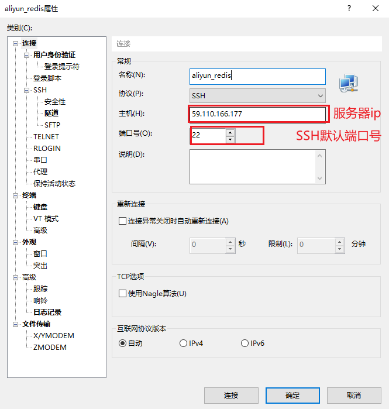


2、使用**Xftp**将本地的**redis安装文件**传输到**服务器指定目录**中

- 打开**Xftp**
  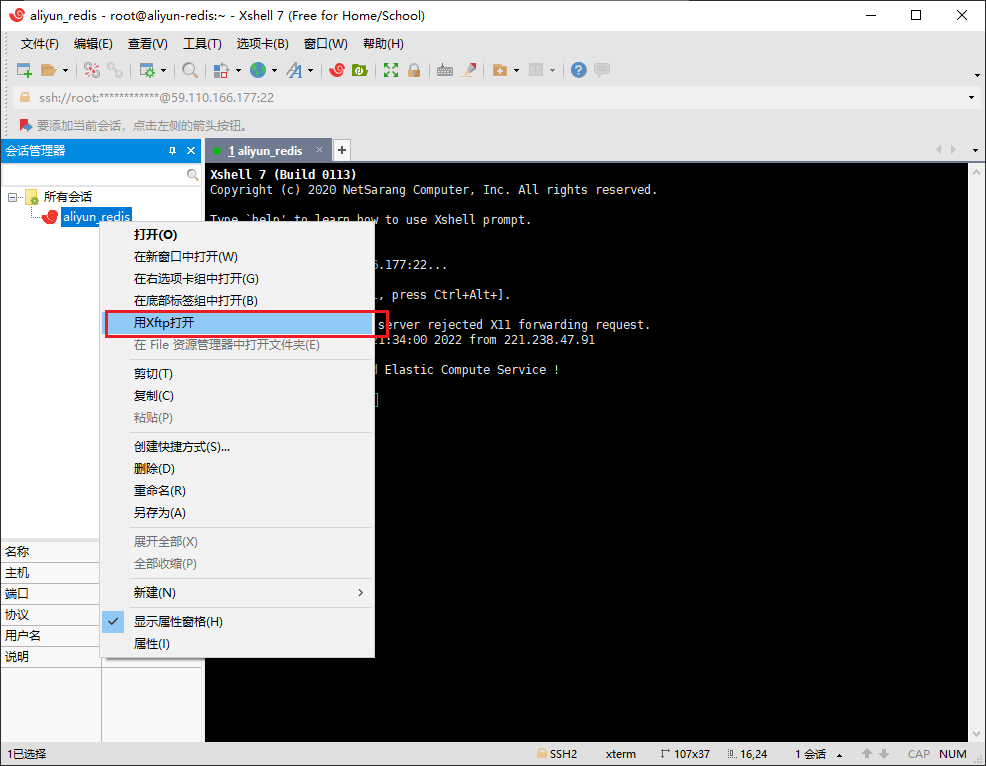
- 将本地的**redis安装文件**传输到**服务器指定目录**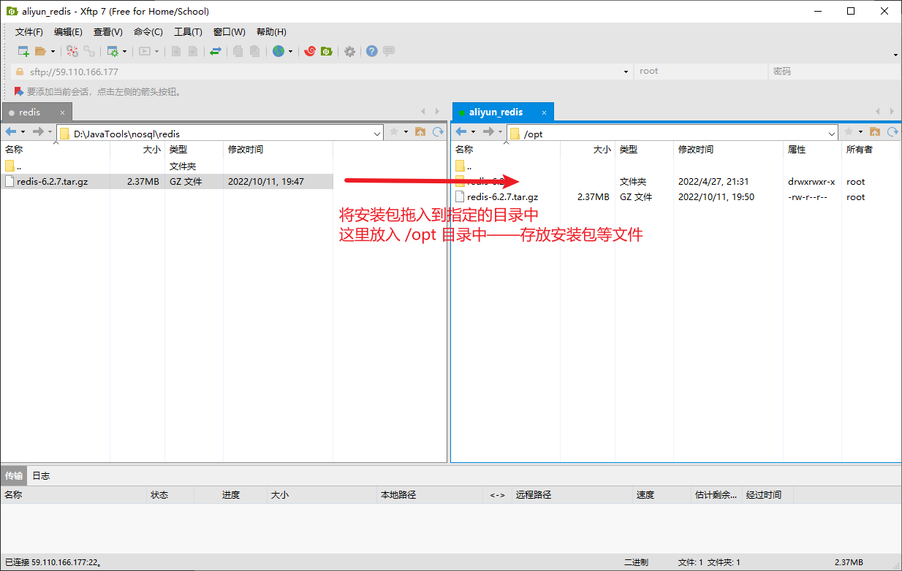


### 1. Linux操作

#### 1. 安装gcc编译器

- 首先通过==`# gcc --version`==检查是否安装gcc编译器
  
- 如果没有安装gcc，则输入==`# yum install gcc`==安装gcc编译器


#### 2. 解压Redis安装包

进入安装包目录`# cd /opt `使用解压命令==`# tar -zxvf redis-6.2.7.tar.gz`==解压安装包
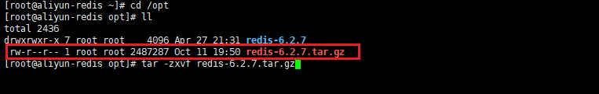


#### 3. 编译Redis文件

解压完成后进入目录`# cd /opt/redis-6.2.7`，然后在redis-6.2.7目录下使用==`# make`==命令编译redis解压后的文件


#### 4. 安装Redis

同样在该目录下`# cd redis-6.2.7`，继续执行==`# make install`==命令安装Redis，默认安装路径为==`# /usr/local/bin`== 

>首先注意 **usr 指 Unix System Resource**，而不是user
>
>**/usr/bin
>系统预装的一些可执行程序，随系统升级会改变**
>
>**/usr/local/bin
>用户安装的可执行程序，不受系统升级影响，用户编译安装软件时，一般放到/usr/local/bin目录下**


#### 4. 备份配置文件

之后进入redis目录中`# cd /opt/redis-6.2.7 `，将 **redis.conf **文件复制到 ==`/etc`==目录下，<u>后台启动则使用该配置文件</u>
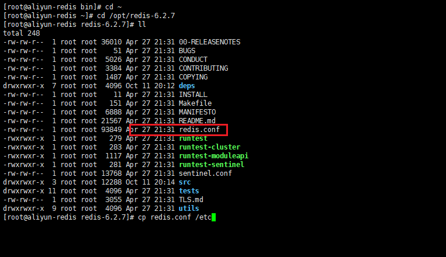


#### 5. 修改配置文件

进入**复制后**的配置文件目录`# cd /etc`，修改配置文件
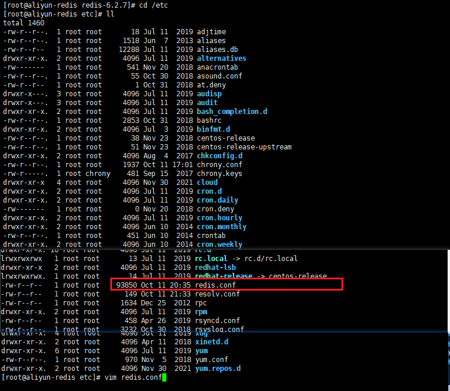

>## centos7系统文件名颜色含义
>
>浅蓝色：表示链接文件；
>
>灰色：表示其他文件；
>
>绿色：表示[可执行文件](https://so.csdn.net/so/search?q=可执行文件&spm=1001.2101.3001.7020)；
>
>红色：表示压缩文件；
>
>蓝色：表示目录；
>
>红色闪烁：表示链接的文件有问题了；
>
>黄色：表示设备文件


后台启动则设置 ==`daemonize no`为 `yes`==，**保证在SSH连接关闭后依然能使用redis**
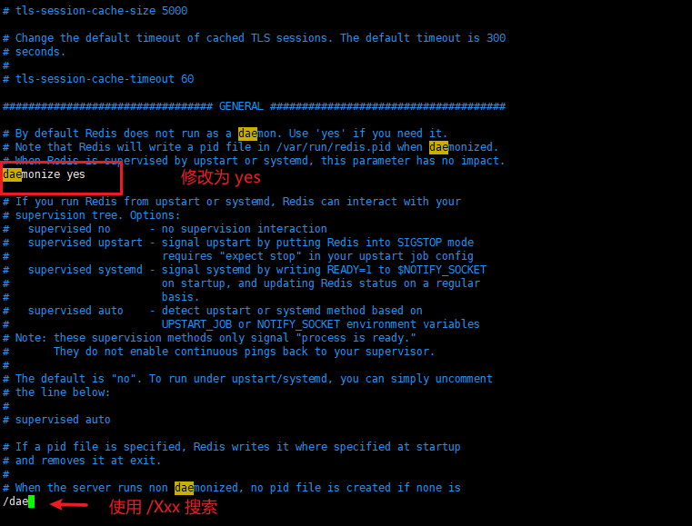


#### 6. 后台启动Redis

✨进入默认安装路径为==`# /usr/local/bin`== ，使用**==`# redis-server /etc/redis.conf`==**命令启动Redis服务！
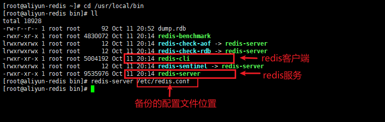


使用==`# ps -ef | grep redis`==查看进程状态信息
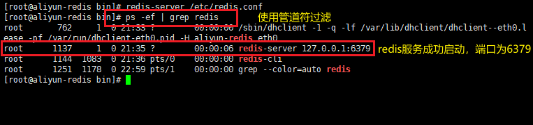


使用==`# redis-cli`==命令启用redis客户端，即可操作Redis数据库！
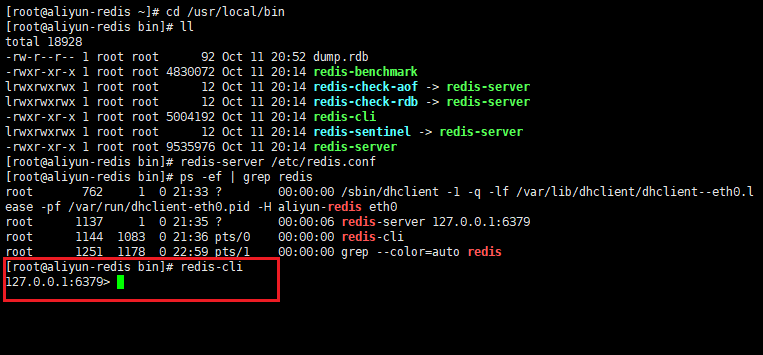


**关闭终端**

- 使用**`> exit`**即可退出终端
- 或者 **ctrl + c** 强制退出


#### 7. 关闭Redis

- 单实例关闭：**`# redis-cli shutdown`**

- 进入终端后关闭：**`> shutdown`**

- 多实例关闭，指定端口关闭：**`# redis-cli -p 6379 shutdown`**

- 可以使用 **`# kill -9 xxxx`**关闭进程（xxxx为进程号）


## 3. Redis相关知识

默认0号库

串行  

单线程 + 多路IO复用


# 3. 常用5种数据类型

详见官网：https://redis.io/commands/

## 1. Redis键

### 1. key值的操作

- keys * 查看当前库所有key
- set key value 设置key值与value
- exists key 判断key是否存在:1 则存在  0 不存在
- type key 查看key是什么类型
- del key 删除指定的key数据
- **unlink key 根据value选择非阻塞删除**
  ------仅将keys从keyspace元数据中删除，真正的删除会在后续异步操作。
- expire key 10 10秒钟：为给定的key设置过期时间
- ttl key 查看还有多少秒过期，-1表示永不过期，-2表示已过期


### 2. 库的选择

- `select` 命令切换数据库
- `dbsize` 查看当前数据库的key数量
- `flushdb` 清空当前库
- `flushall` 通杀全部库


---

## 2. Redis字符串(String)

### 1. 简介

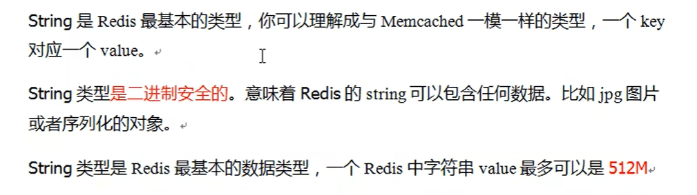

### 2. 常用命令

参数设置：

- set key value 设置key值
- get key 查询key值
- append key value 将给定的value追加到原值末尾
- strlen key 获取值的长度
- setnx key value 只有在key不存在的时候，设置key值
- incr key 将key值存储的数字增1，只对数字值操作，如果为空，新增值为1
- decr key 将key值存储的数字减1，只对数字值操作，如果为空，新增值为1
- decr key 将key值存储的数字减1
- incrby/decrby key <步长> 将key值存储的数字增减如步长

补充额外的字符串参数：

- mset key value key value..同时设置一个或者多个key-value
- mget key key...同时获取一个或多个value
- msetnx key value key value..同时设置一个或者多个key-value.当且仅当所有给定key都不存在
- getrange key <起始位置> <结束位置> 获取key的起始位置和结束位置的值
- setrange key <起始位置> value 将value的值覆盖起始位置开始
- setex key <> value 设置键值的同时,设置过期时间
- getset key value 用新值换旧值

> **原子性**
> 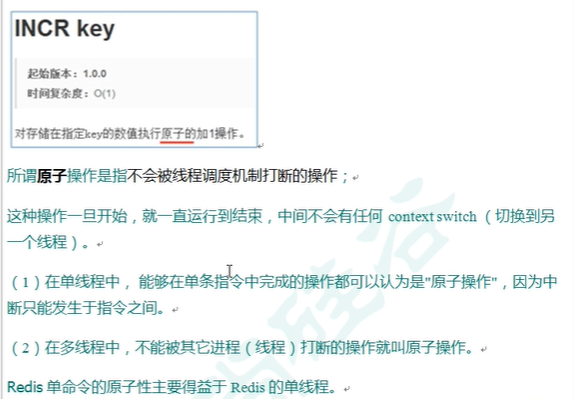
>
> **Java举例**
> 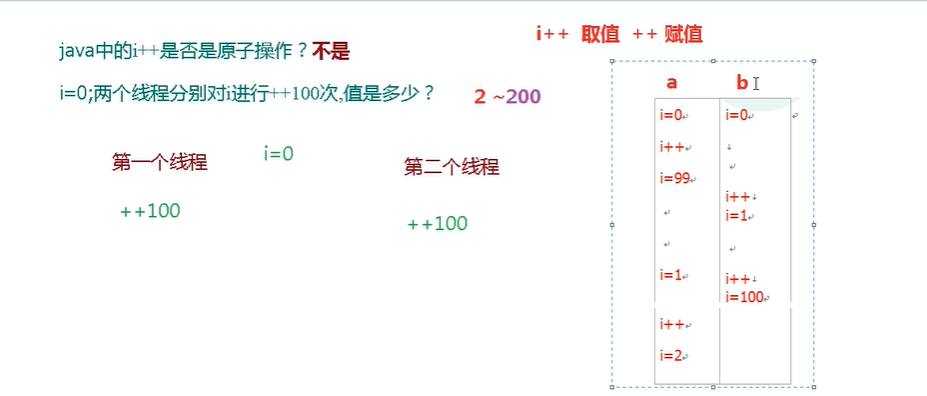


### 3.数据结构


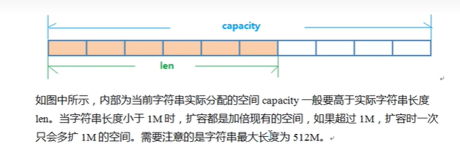


## 3. Redis列表(List)


### 1. 简介


### 2. 常用命令

- lpush/rpush key value value...从左或者右插入一个或者多个值(头插与尾插)
- lpop/rpop key 从左或者右吐出一个或者多个值(值在键在,值都没,键都没)
- rpoplpush key1 key2 从key1列表右边吐出一个值,插入到key2的左边
- lrange key start stop 按照索引下标获取元素(从左到右)
- lrange key 0 -1 获取所有值
- lindex key index 按照索引下标获得元素
- llen key 获取列表长度
- linsert key before/after value newvalue 在value的前面插入一个新值
- lrem key n value 从左边删除n个value值
- lset key index value 在列表key中的下标index中修改值value
  

### 3. 数据结构

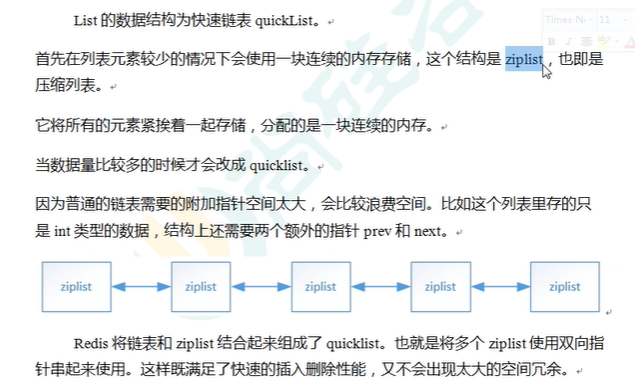


## 4. Redis集合(Set)

### 1. 简介


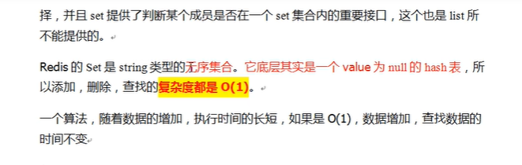


### 2. 常用命令

- sadd key value value... 将一个或者多个member元素加入集合key中,已经存在的member元素被忽略
- smembers key 取出该集合的所有值
- sismember key value 判断该集合key是否含有改值
- scard key 返回该集合的元素个数
- srem key value value 删除集合中的某个元素
- spop key 随机从集合中取出一个元素
- srandmember key n 随即从该集合中取出n个值，不会从集合中删除
- smove <一个集合a><一个集合b>value 将一个集合a的某个value移动到另一个集合b
- sinter key1 key2 返回两个集合的交集元素
- sunion key1 key2 返回两个集合的并集元素
- sdiff key1 key2 返回两个集合的差集元素（key1有的，key2没有）


### 3. 数据结构


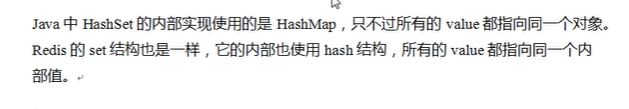


## 5. Redis哈希(Hash)

### 1. 简介

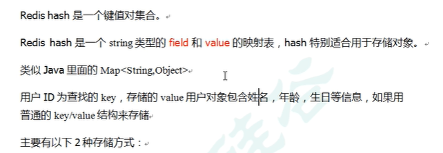

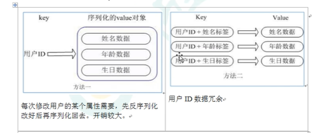

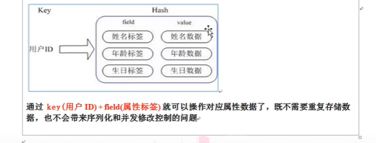


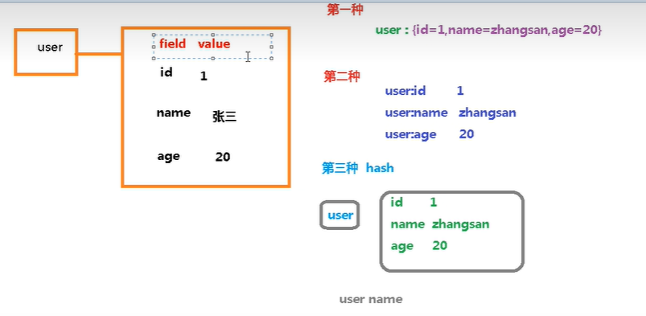

### 2. 常用命令

- hset key field value 给key集合中的filed键赋值value
- hget key1 field 集合field取出value
- hmset key1 field1 value1 field2 value2 批量设置hash的值
- hexists key1 field 查看哈希表key中，给定域field是否存在
- hkeys key 列出该hash集合的所有field
- hvals key 列出该hash集合的所有value
- hincrby key field increment 为哈希表key中的域field的值加上增量1 -1
- hsetnx key field value 将哈希表key中的域field的值设置为value，当且仅当域field不存在


### 3. 数据结构


## 6. Redis有序集合Zset(Sorted set)

### 1. 简介


### 2. 常用命令

- hset key field value 给key集合中的filed键赋值value
- hget key1 field 集合field取出value
- hmset key1 field1 value1 field2 value2 批量设置hash的值
- hexists key1 field 查看哈希表key中，给定域field是否存在
- hkeys key 列出该hash集合的所有field
- hvals key 列出该hash集合的所有value
- hincrby key field increment 为哈希表key中的域field的值加上增量1 -1
- hsetnx key field value 将哈希表key中的域field的值设置为value，当且仅当域field不存在


### 3. 数据结构

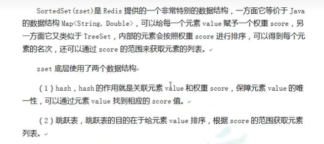


### 4.  跳跃表

#### 1. 简介


#### 2. 实例 

对比有序列表和跳跃表

##### 1. 有序列表

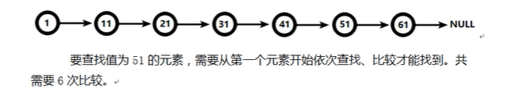

##### 2. 跳跃表

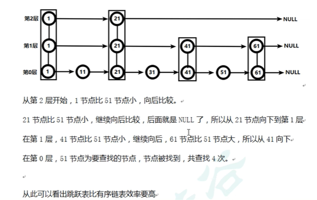


# 4. 配置文件

- \# bind 127.0.0.1

- protected-mode no

- daemonize yes

-  requirepass foobared

  重置密码（最好没有规则）附随机密码生成器：https://suijimimashengcheng.bmcx.com/

  > **密码：==wFDoZDPUy8tOzvR5== **
  >
  > 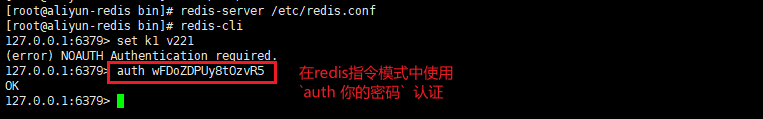


## 1. Units单位


```
# Redis configuration file example.
#
# Note that in order to read the configuration file, Redis must be
# started with the file path as first argument:
#
# ./redis-server /path/to/redis.conf

# Note on units（计量单位）: when memory size is needed, it is possible to specify
# it in the usual form of 1k 5GB 4M and so forth:
#
# 1k => 1000 bytes
# 1kb => 1024 bytes
# 1m => 1000000 bytes
# 1mb => 1024*1024 bytes
# 1g => 1000000000 bytes
# 1gb => 1024*1024*1024 bytes
#
# units are case insensitive（大小写不敏感） so 1GB 1Gb 1gB are all the same.
```


## 2. include


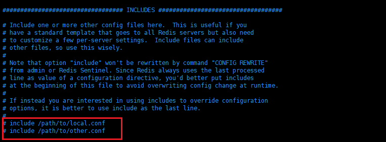


## 3. 网络配置相关

### 1. bind

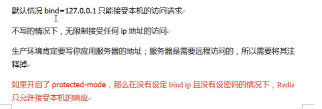

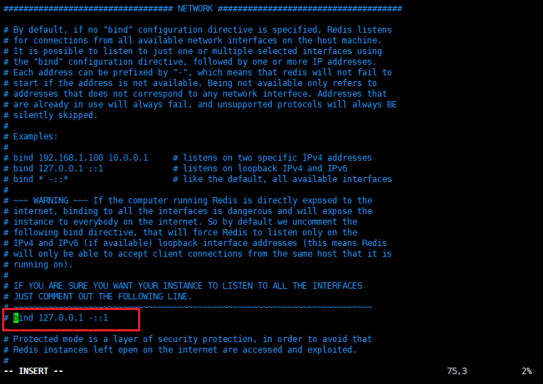


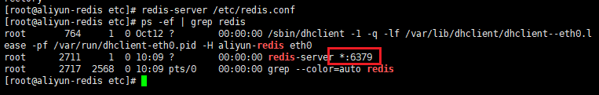


### 2.  protected-mode

**关闭本机的保护模式，支持bind设置的远程访问**

**设置为 no**

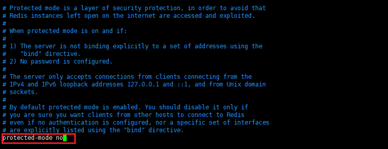


### 3. port

**端口号，默认是 6379**

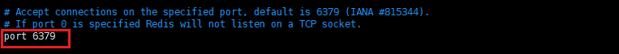


### 4. tcp-backlog

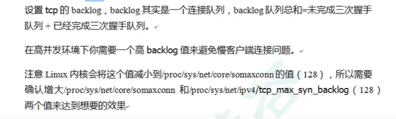

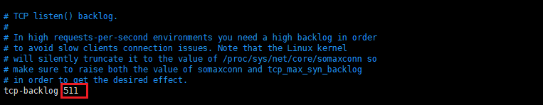

In high requests-per-second environments you need a high backlog in order to avoid slow clients connection issues.   Note that the Linux kernel will silently truncate it to the value of /proc/sys/net/core/somaxconn so make sure to raise both the value of somaxconn and tcp_max_syn_backlog in order to get the desired effect.

在每秒请求数高的环境中，您需要一个高顺序的backlog避免客户端连接缓慢的问题。注意Linux内核是否将它静默地截断为/proc/sys/net/core/somaxconn的值确保提高somaxconn和tcp_max_syn_backlog的值才能达到预期的效果。


### 5. timeout

**超时时间，为0则永不超时**

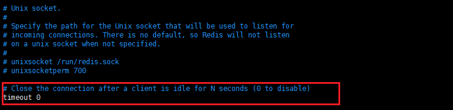


### 6. tcp-keepalive

**检查心跳时间，如果没有进行操作则停止连接，间隔为300s**

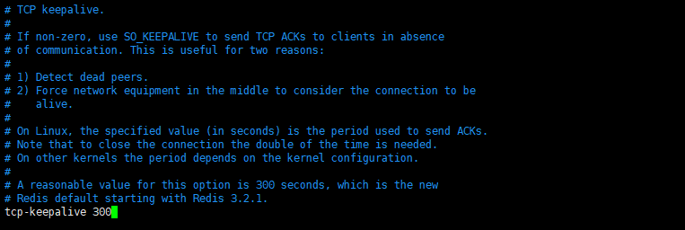


## 4. 基本配置

### 1. daemonize 

**是否为后台进程**

**设置为 yes**


### 2.  pidfile

**redis每次操作会有一个进程号pid**

**存放 pid 文件的位置，每个实例会产生一个不同的 pid**

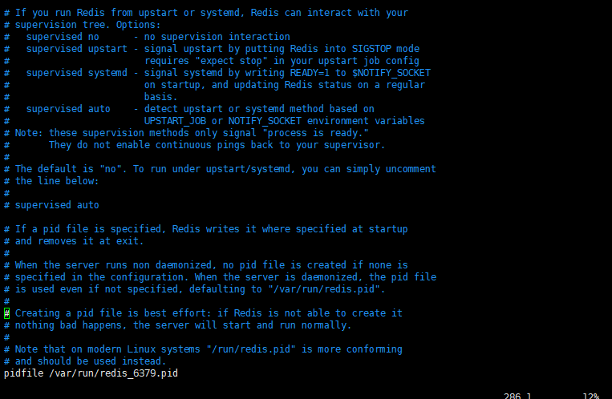


### 3. loglevel


### 4. logfile

**日志文件名称**


### 5.  database 16

**设定库的数量，默认16 ，默认数据库为0，可以使用SELECT\<dbid>命令在连接上指定数据库 id**

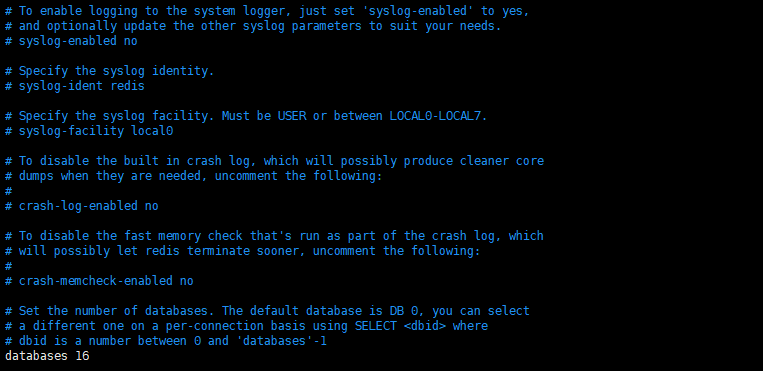


## 5. 安全性

### 1. 设置密码

**wFDoZDPUy8tOzvR5**

**设置完密码后，在redis客户端使用 `auth 密码`进行认证**


## 6. limits限制

### 1. maxclients

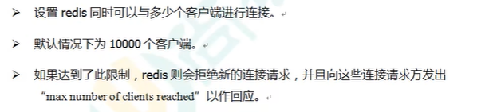


### 2. maxmemory


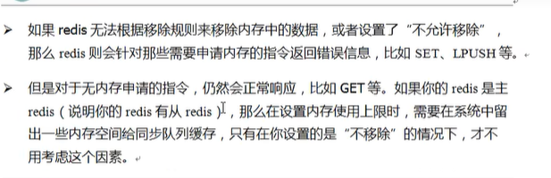


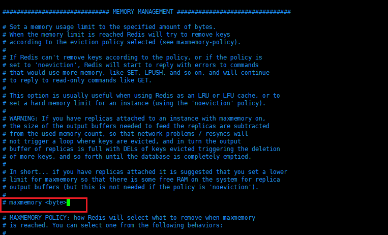


### 3. maxmemory-policy

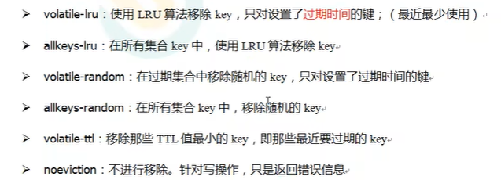


### 4. maxmemory-samples


##  7. SNAPSHOTTING  

**Redis持久化之RDB**

### 1. save

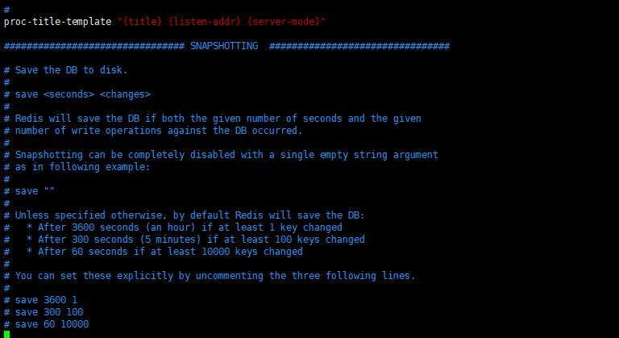


### 2. stop-writes-on-bgsave-error


### 3. rdbcompression


### 4. rdbchecksum


### 5. dbfilename

**修改备份文件的名称**

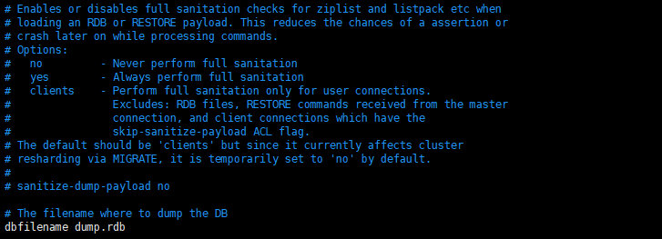


### 6. dir

**修改备份文件的位置**

问题在于配置文件属性dir ,默认配置是**dir ./  表示**启动server时候的当前目录,也就是说之前测试线启动redis服务是在 / 目录下启动的。

**重点是 dir 的默认配置一定要改，改成确定路径，这样就不会存在每次启动服务时所在的目录不一样导致dump文件找不到的问题**


## 8. APPEND ONLY MODE

**Redis持久化之AOF**

### 1. appendonly

默认为 no，设置为 yes 开启 **Redis持久化之AOF**

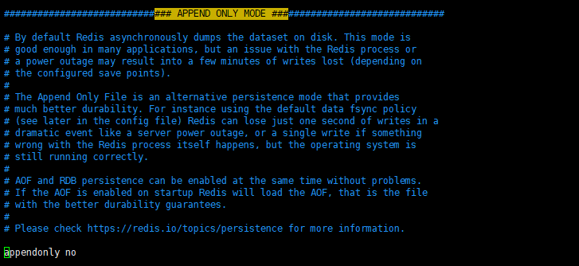


### 2. appendfilename


### 3. appendfsync

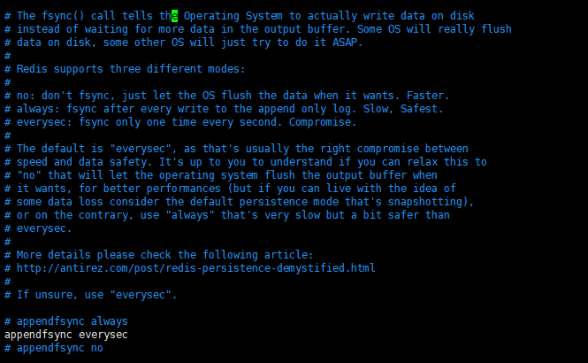


### 4. 杂项


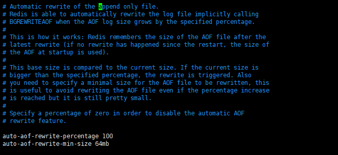


## 9. REPLICATION

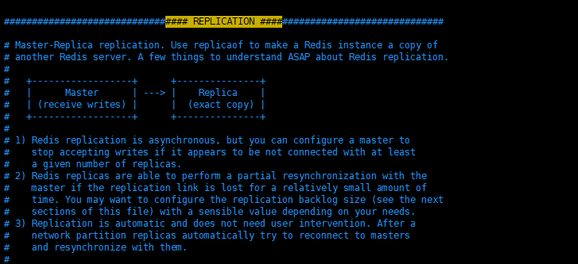

1. Redis replication is asynchronous, but you can configure a master to  stop accepting writes if it appears to be not connected with at least  a given number of replicas.  
   Redis复制是异步的，但是你可以配置一个主主机，如果它看起来没有与至少给定数量的副本连接，它就停止接受写操作。

2) Redis replicas are able to perform a partial resynchronization with the master if the replication link is lost for a relatively small amount of     time.   You may want to configure the replication backlog size (see the next  sections of this file) with a sensible value depending on your needs.  
   如果复制链路在相对较短的时间内丢失，Redis副本能够执行与主服务器的部分重新同步。您可能希望配置复制待办事项列表大小(请参阅此文件的下一部分)，根据您的需要使用合理的值。
3)  Replication is automatic and does not need user intervention.   After a   network partition replicas automatically try to reconnect to masters   and resynchronize with them.
   复制是自动的，不需要用户干预。在一个网络分区后，副本自动尝试重新连接到主节点并与它们重新同步。


### 1. masterauth


# 5. Redis的发送和订阅


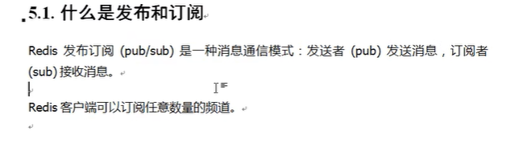


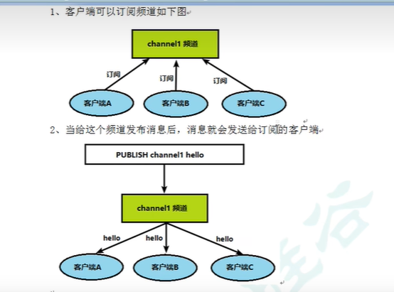


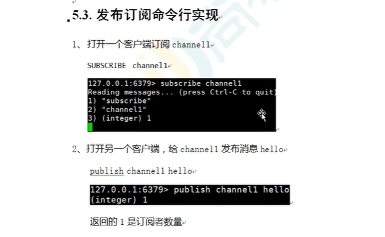


# 6. Redis新数据类型

## 1. Bitmaps

### 1. 简介

字符串

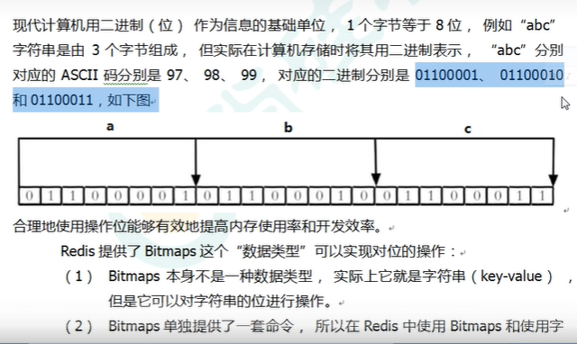

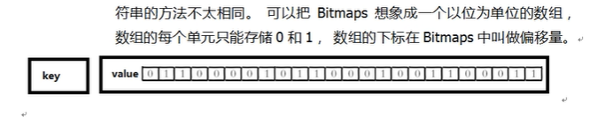


### 2. 命令

#### 1. setbit

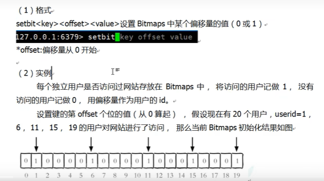

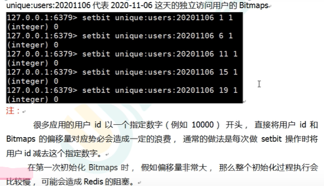


#### 2. getbit


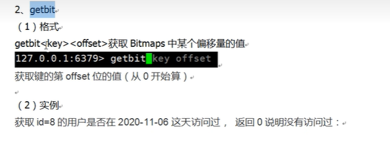

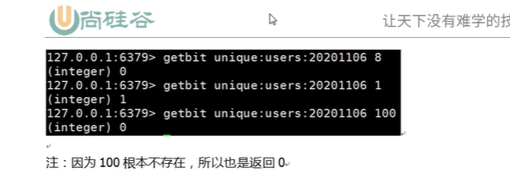


#### 3. bitcount

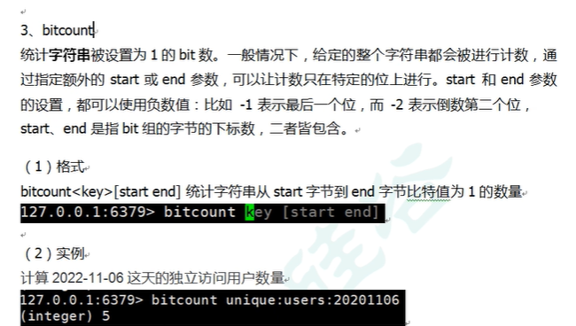

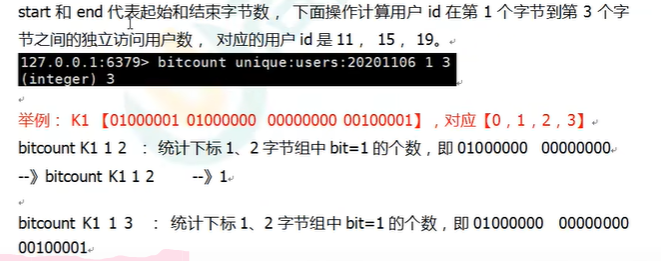

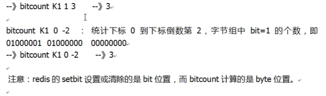


#### 4. bitop

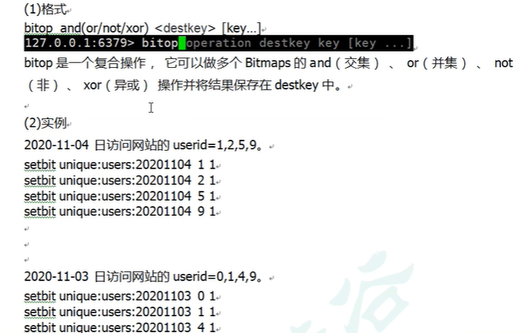

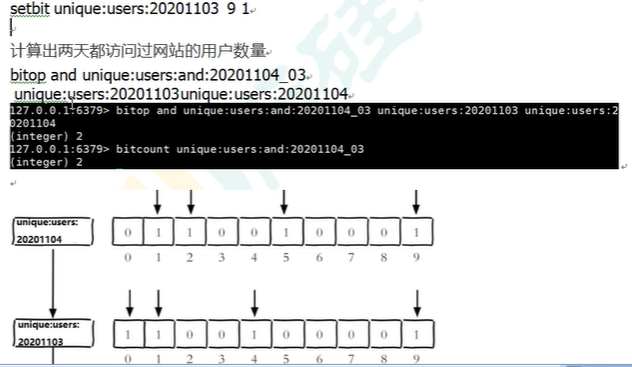

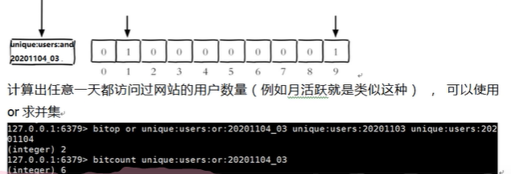

and 会去重复值并返回


### 3. Bitmaps与set对比


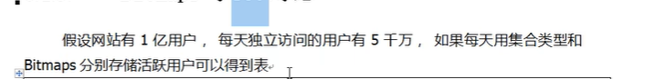

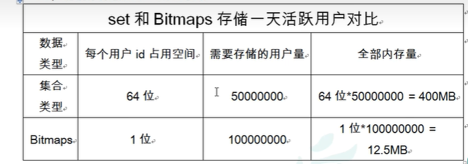

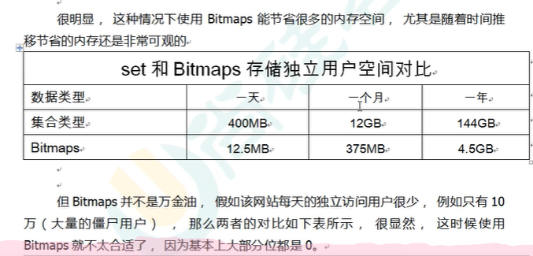


## 2. HyperLogLog

### 1. 简介

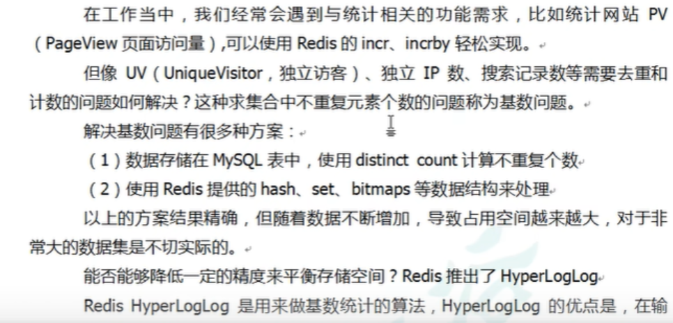

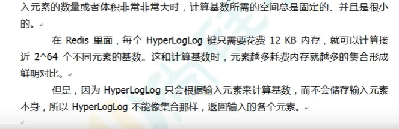

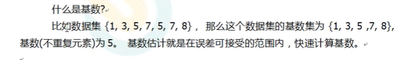


### 2. 命令

#### 1. pfadd

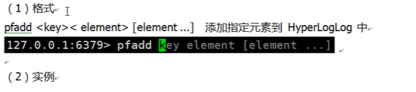

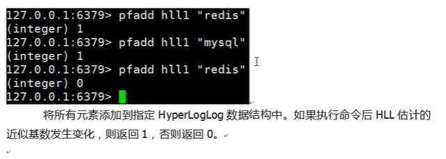


#### 2. pfcount

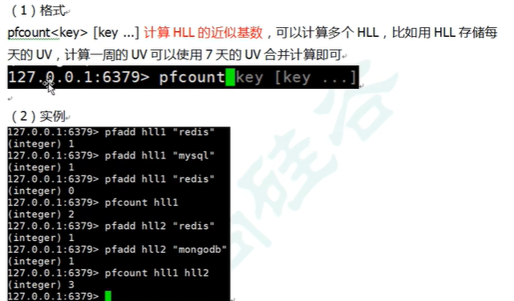


#### 3. pfmerge

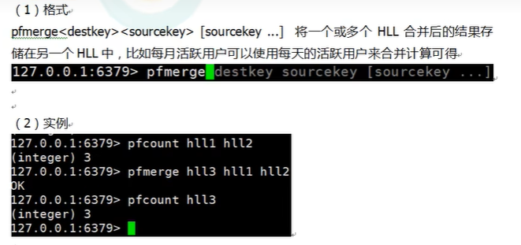


## 3. Geospatial

### 1. 简介


### 2. 命令 

#### 1. geoadd

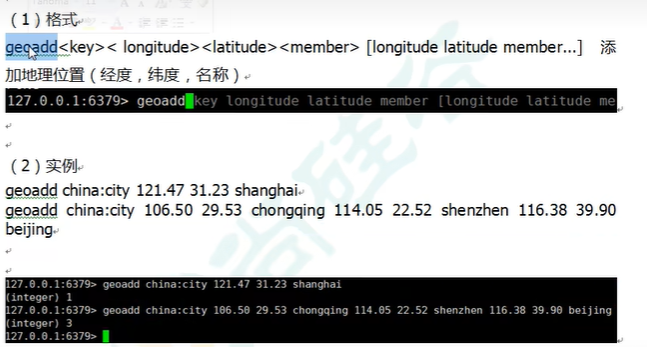


#### 2. geopos

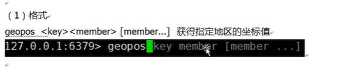

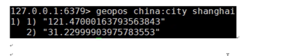


#### 3.  geodist

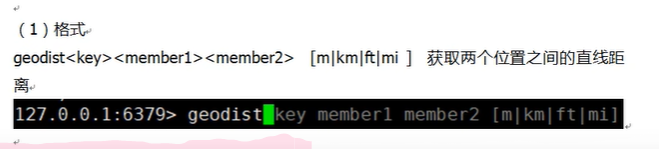

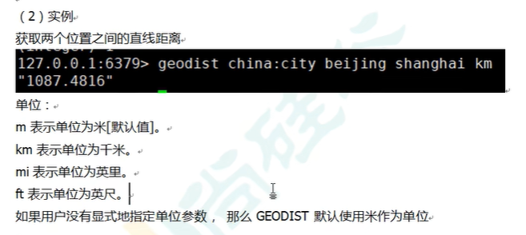


#### 4. georadius

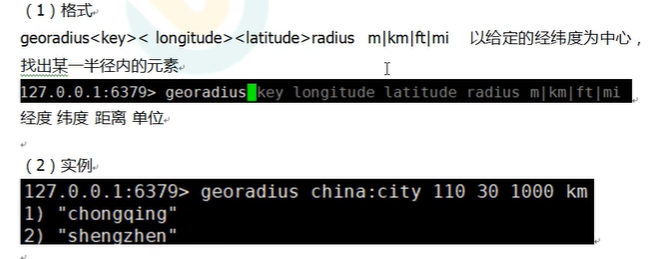


# 7. SpringBoot整合Redis


## 1. pom配置

```xml
<!--redis依赖配置-->
<dependency>
    <groupId>org.springframework.boot</groupId>
    <artifactId>spring-boot-starter-data-redis</artifactId>
</dependency>

<!-- Spring2.X集成redis所需common-pool2 -->
<dependency>
    <groupId>org.apache.commons</groupId>
    <artifactId>commons-pool2</artifactId>
    <version>2.11.1</version>
</dependency>
```


## 2. 配置文件

```yaml
spring：
    redis:
        host: localhost # Redis服务器地址
        database: 0 # Redis数据库索引（默认为0）
        port: 6379 # Redis服务器连接端口
        password: # Redis服务器连接密码（默认为空）
        jedis: #或者lettuce
          pool:
            max-active: 8 # 连接池最大连接数（使用负值表示没有限制）
            max-wait: -1ms # 连接池最大阻塞等待时间（使用负值表示没有限制）
            max-idle: 8 # 连接池中的最大空闲连接
            min-idle: 0 # 连接池中的最小空闲连接
        timeout: 3000ms # 连接超时时间（毫秒）
```


# 8. 事务与锁机制

## 1. Redis事务的定义

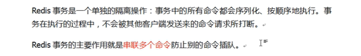


## 2. Multi、Exec、discard


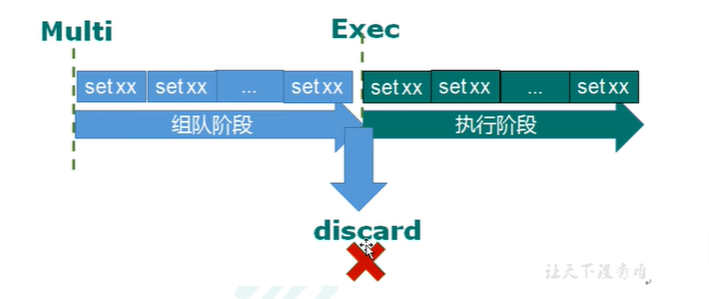

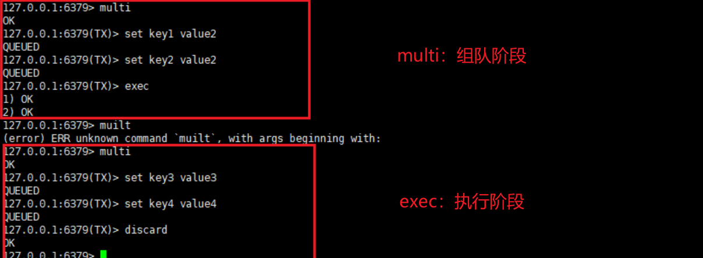


## 3. 事务的错误处理

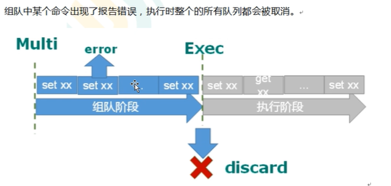

**类似编译时出错**


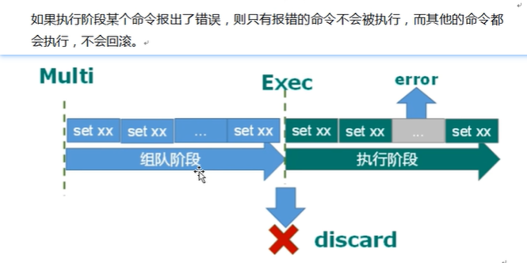

**类似运行时出错**

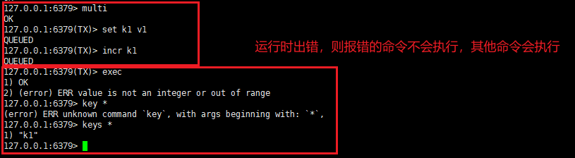


## 4. 为什么要做成事务


## 5. 事务冲突的例子

### 1. 例子                                                  

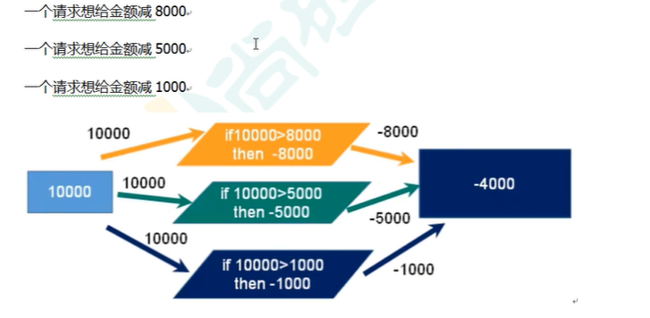

### 2. 悲观锁

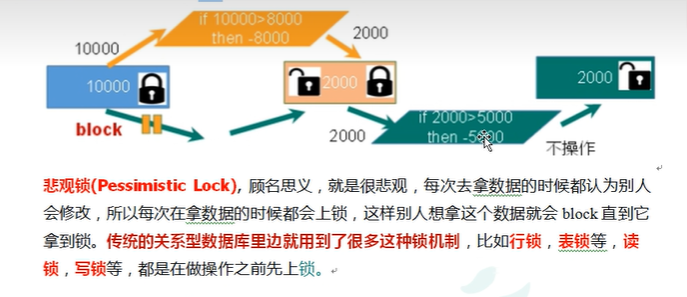

 

### 3. 乐观锁

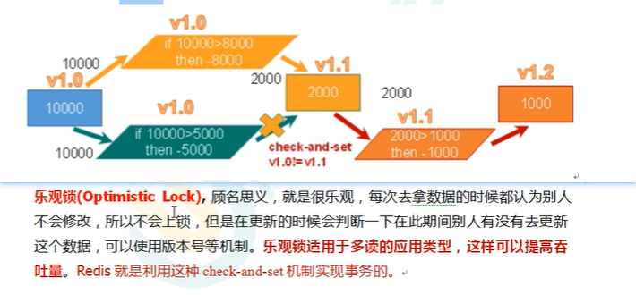


### 4.  WATCH key [key …]


**先执行客户端一**

**客户端一：**

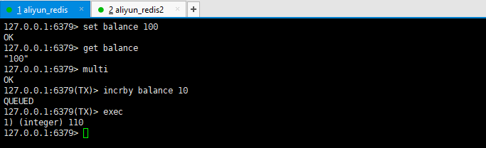

**客户端二：**

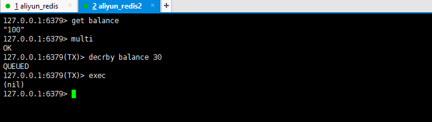


### 5. UNWATCH


**客户端一：执行**

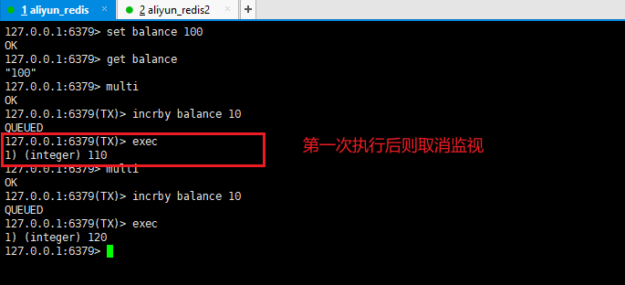

**客户端二：执行**

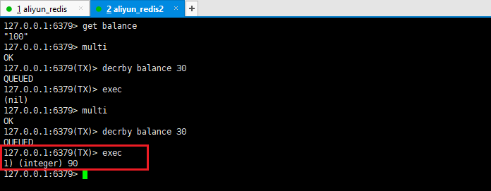


## 6. 事务三特性

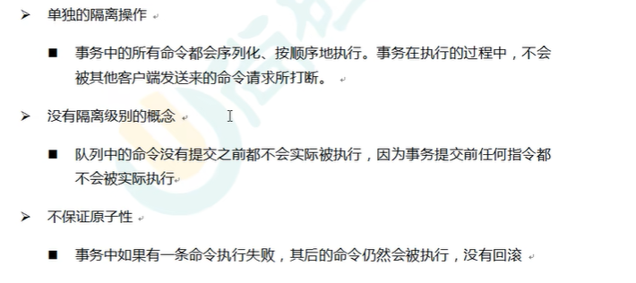

 

# 9. Redis持久化

## 1. 总体介绍

网址：https://redis.io/docs/manual/persistence/

**Redis persistence**

How Redis writes data to disk (append-only files, snapshots, etc.)

Persistence refers to the writing of data to durable storage, such as a solid-state disk (SSD). Redis itself provides a range of persistence options:

- **RDB** (Redis Database): The RDB persistence performs point-in-time snapshots of your dataset at specified intervals.
- **AOF** (Append Only File): The AOF persistence logs every write operation received by the server, that will be played again at server startup, reconstructing the original dataset. Commands are logged using the same format as the Redis protocol itself, in an append-only fashion. Redis is able to [rewrite](https://redis.io/docs/manual/persistence/#log-rewriting) the log in the background when it gets too big.
- **No persistence**: If you wish, you can disable persistence completely, if you want your data to just exist as long as the server is running.
- **RDB + AOF**: It is possible to combine both AOF and RDB in the same instance. Notice that, in this case, when Redis restarts the AOF file will be used to reconstruct the original dataset since it is guaranteed to be the most complete.

The most important thing to understand is the different trade-offs between the RDB and AOF persistence.

## 2. RDB(Redis DataBase)


### 1. 是什么

- 在**指定的时间间隔内**将内存中的数据集快照**写入磁盘**，也就是行话讲的Snapshot快照，它**恢复时是将快照文件直接读到内存里。**

- Redis会单独创建（fork）一个子进程来进行持久化，会先将数据写入到 一个临时文件中，待持久化过程都结束了，再用这个临时文件替换上次持久化好的文件。 整个过程中，主进程是不进行任何IO操作的，这就确保了极高的性能。如果需要进行大规模数据的恢复，且对于数据恢复的完整性不是非常敏感，那RDB方式要比AOF方式更加的高效。RDB的缺点是最后一次持久化后的数据可能丢失。

  >**Fork的作用是复制一个与当前进程一样的进程。**新进程的所有数据（变量、环境变量、程序计数器等） 数值都和原进程一致，但是是一个全新的进程，并作为原进程的子进程

- **RDB 保存的是dump.rdb文件，备份的文件位置如下(usr/local/bin)**
  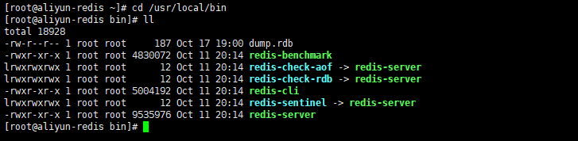


### 2. RDB配置

相关配置在配置文件的位置 - 在redis.conf搜寻`### SNAPSHOTTING ###`

[配置文件详见](# 7. SNAPSHOTTING  )

 

可将其修改为如下：


### 3. 如何触发RDB快照

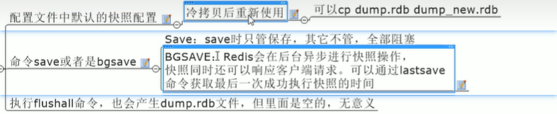

- 配置文件中默认的快照配置dbfilename dump.rdb
  - 冷拷贝后重新使用
    - 可以cp dump.rdb dump_new.rdb
- 命令save或者是bgsave
  - Save：save时只管保存，其它不管，全部阻塞
  - BGSAVE：Redis会在后台异步进行快照操作， 快照同时还可以响应客户端请求。可以通过lastsave 命令获取最后一次成功执行快照的时间

- 
  执行flushall命令，也会产生dump.rdb文件，但里面是空的，无意义
  

------------------------------------------------


### 4. 如何恢复备份✨


- ✨将备份文件 (dump.rdb) 移动到 redis 安装目录并启动服务即可，**redis自动加载该文件**
- `CONFIG GET dir`获取目录

#### 1. 默认规则

**0、修改配置文件**

**表示在60s内对key操作10次则自动备份**
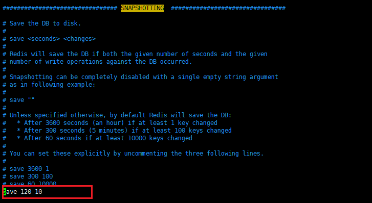


**1、客户端一在指定时间中操作指定条key数据**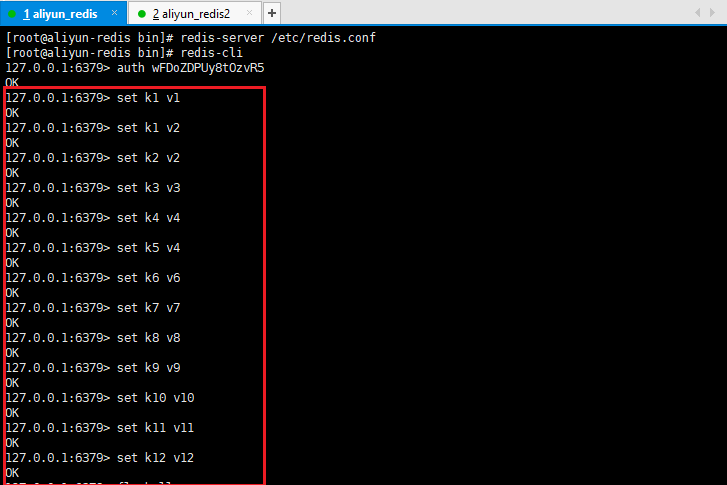


**2、则redis自动生成一个名为 dump.rdb的备份文件**
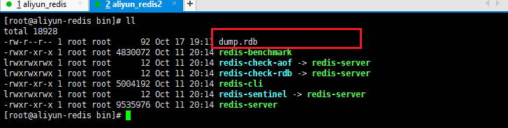


**3、客户端二备份该备份文件**
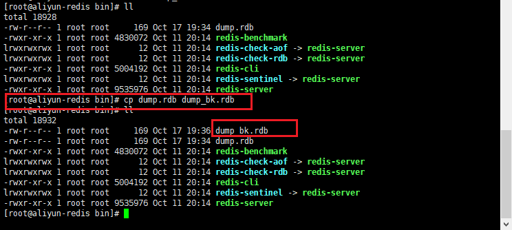


**4、客户端一使用`flushall`命令清空redis所有库**
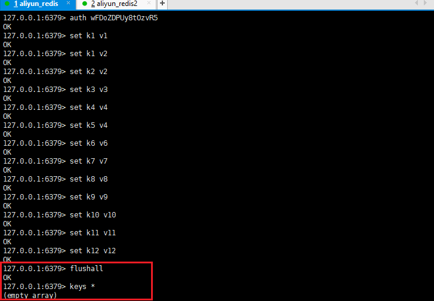

> **注意：此时的dump.rdb文件在`flushall`命令执行后被覆盖（注意时间），现在的值为空**
> 


**5、还原该备份文件**

客户端一再次启动redis，依旧为空
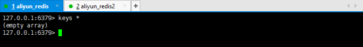

**此时使用以下命令覆盖dump.rdb文件**
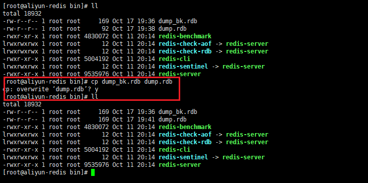

**此时dump.rdb文件被覆盖，客户端一重新启动redis**


> **注意：此时的值为10个，之前保存了12个**


#### 2. 命令方式

**\# 不使用默认的规则，当即备份（使用`save`）**
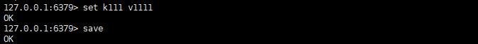

客户端二dump.rdb更新，覆盖原文件
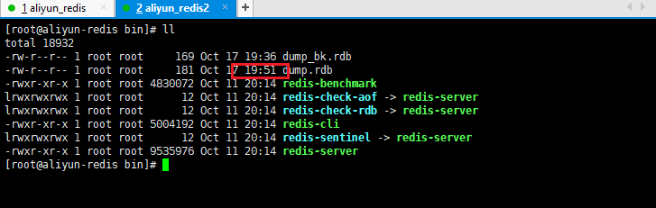


### 5. 优劣势

- **优势**
  - 适合大规模的数据恢复
  - 对数据完整性和一致性要求不高
- **劣势**
  - 在一定间隔时间做一次备份，所以如果redis意外down掉的话，就 会丢失最后一次快照后的所有修改
  - Fork的时候，内存中的数据被克隆了一份，大致2倍的膨胀性需要考虑


### 6.如何停止

动态所有停止RDB保存规则的方法：`redis-cli config set save ""`


### #. 小结

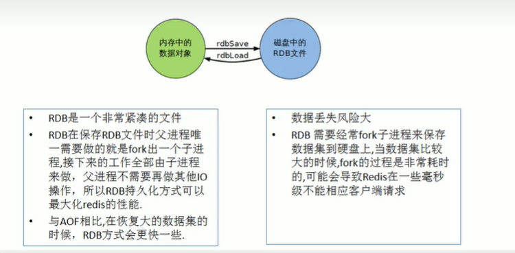

**RDB是一个非常紧凑的文件。**
RDB在保存RDB文件时父进程唯一需要做的就是fork出一个子进程，接下来的工作全部由子进程来做，父进程不需要再做其他I0操作，所以RDB持久化方式可以最大化redis的性能。
与AOF相比，在恢复大的数据集的时候，RDB方式会更快一一些。

**数据丢失风险大。**
RDB需要经常fork子进程来保存数据集到硬盘上，当数据集比较大的时候fork的过程是非常耗时的吗，可能会导致Redis在一些毫秒级不能回应客户端请求。

------------------------------------------------
版权声明：本文为CSDN博主「巨輪」的原创文章，遵循CC 4.0 BY-SA版权协议，转载请附上原文出处链接及本声明。
原文链接：https://blog.csdn.net/u011863024/article/details/107476187


## 3. AOF(Append Only File)


### 1. 是什么

**以日志的形式来记录每个写操作**，将Redis执行过的所有==写指令==记录下来(**读操作不记录**)， 只许追加文件但不可以改写文件，redis启动之初会读取该文件重新构建数据，换言之，redis 重启的话就根据日志文件的内容将写指令从前到后执行一次以完成数据的恢复工作


### 2. AOF配置

- 相关配置在配置文件的位置 - 在redis.conf搜寻`### APPEND ONLY MODE ###`
- aof保存的是appendonly.aof文件（在配置文件可修改文件名），保存在安装路径下（usr/local/bin）
- [配置文件详见](#8. APPEND ONLY MODE)

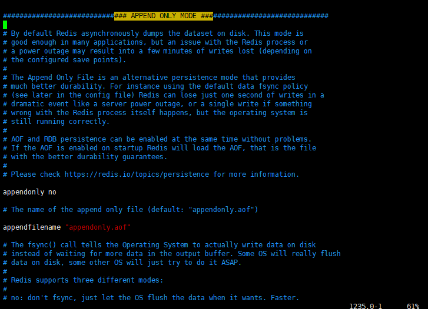


### 3. AOF启动/修复/恢复✨

- 正常恢复
  - 启动：开启AOF持久化
    - 修改默认的`appendonly no`，改为`yes`
  - 将有数据的aof文件复制一份保存到对应目录(config get dir【`/usr/local/bin`】)
  - 恢复：**重启redis然后重新加载**
- 异常恢复
  - 启动：设置Yes
    - 修改默认的appendonly no，改为yes
  - 备份被写坏的AOF文件
  - 修复：
    - `# redis-check-aof --fix appendonly.aof`进行修复
  - 恢复：重启redis然后重新加载


#### 1. AOF启动验证

**0、修改配置文件**

修改默认的appendonly no，改为yes，开启 AOF持久化操作
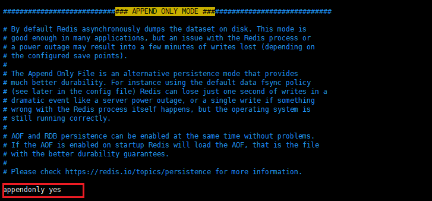


**1、刚启动时redis的安装目录**
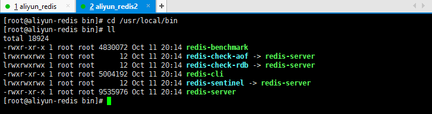


**2、客户端一执行redis命令**
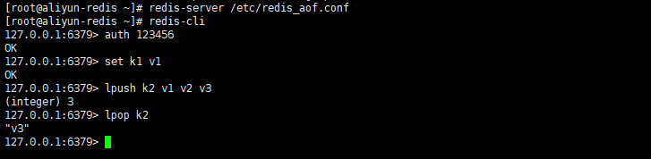

> **注意：此时` /usr/local/bin`目录下经过测试既没有`dump.rdb`文件，也没有`appendonly.aof`文件**
>
> - **使用 `# find / -name dump.rdb `命令找到文件路径为` /etc/dump.rdb`，如下**
>   
>
>   
>
> - **问题在于配置文件属性dir ,默认配置是`dir ./ ` 表示启动server时候的当前目录,也就是说之前测试线启动redis服务是在 `/root `目录下启动的。**
>
>   ```
>   /root
>   这是根用户的主目录。与保留给个人用户的/home下的目录很相似，该目录中还包含仅与根用户有关的条目。
>   ```
>
>   
>
> - **重点是 dir 的默认配置一定要改，改成确定路径，这样就不会存在每次启动服务时所在的目录不一样导致dump文件找不到的问题**
>   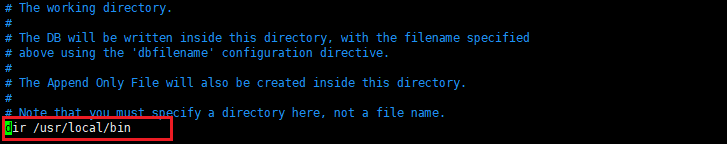

**3、客户端二可查看新生成的`appendonly.aof`文件**
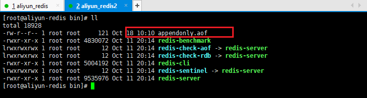


**4、使用`# cat appendonly.aof`查看该文件**
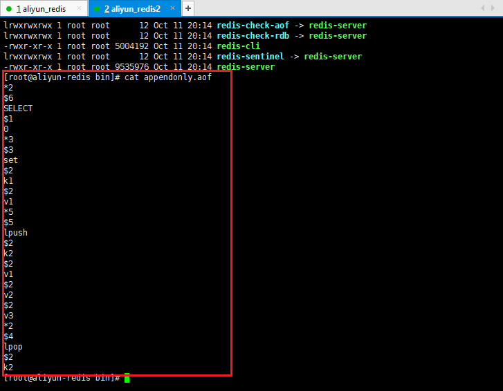


**5、客户端一使用flushall命令**
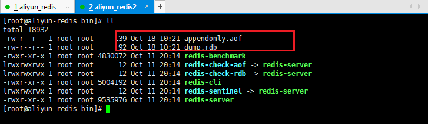

redis在目录下生成 `dump.rdb` 和 `appendonly.aof`文件

> 此时的 `appendonly.aof`文件如下图：
> 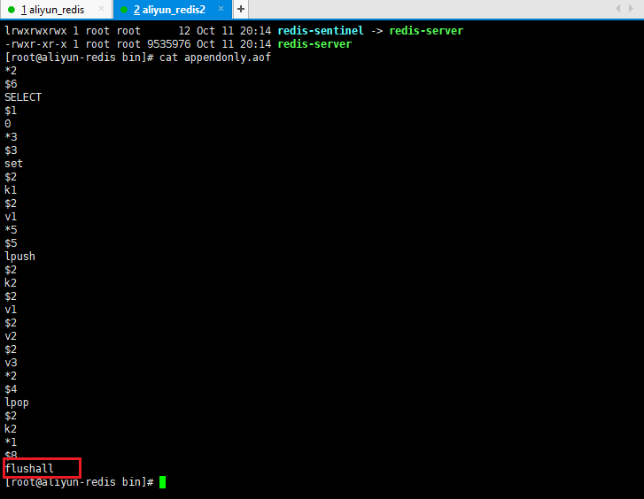

所以即使使用该备份文件，依然得不到数据


#### 2. 备份文件优先级

测试优先级，redis默认先加载 **appendonly.aof** 文件，优先级高于 **dump.rdb**

**测试方式：**

1、在 **appendonly.aof** 文件中添加一些错误语句，如果redis客户端报错，则优先加载 **appendonly.aof** 文件
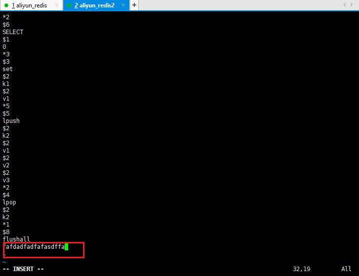


**2、重启redis，报错**


#### 3. AOF修复

使用如下的命令：`# redis-check-aof --fix appendonly.aof`修复


修复后文件如图所示

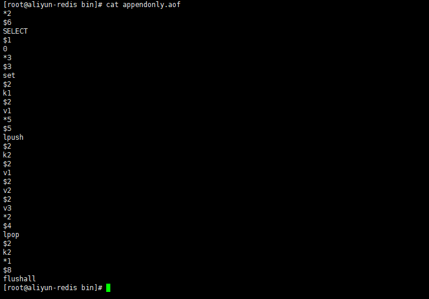

重新启动redis服务即可


### 4. Rewrite

**是什么**

**AOF采用文件追加方式，文件会越来越大。**为避免出现此种情况，新增了重写机制， **当AOF文件的大小超过所设定的阈值时，Redis就会启动AOF文件的内容压缩， 只保留可以恢复数据的最小指令集。**可以使用命令 ==bgrewriteaof==


**重写原理**

AOF文件持续增长而过大时，会fork出一条新进程来将文件重写(也是先写临时文件最后再rename)， 遍历新进程的内存中数据，每条记录有一条的Set语句。重写aof文件的操作，并没有读 取旧的aof文件， 而是将整个内存中的数据库内容用命令的方式重写了一个**新的aof文件**，这点和快照有点类似


**触发机制**

Redis会记录上次重写时的AOF大小，默认配置是当AOF文件大小是上次rewrite后大小的一倍且文件大于64M时触发


### 5. 优势与劣势

**优势**

- 每修改同步：appendfsync always 同步持久化 每次发生数据变更会被立即记录到磁盘 性能较差但数据完整性比较好
- 每秒同步：appendfsync everysec 异步操作，每秒记录 如果一秒内宕机，有数据丢失
- 不同步：appendfsync no 从不同步

**劣势**

- **相同数据集的数据而言aof文件要远大于rdb文件，恢复速度慢于rdb**
- **Aof运行效率要慢于rdb,每秒同步策略效率较好，不同步效率和rdb相同**


### 6. 小结

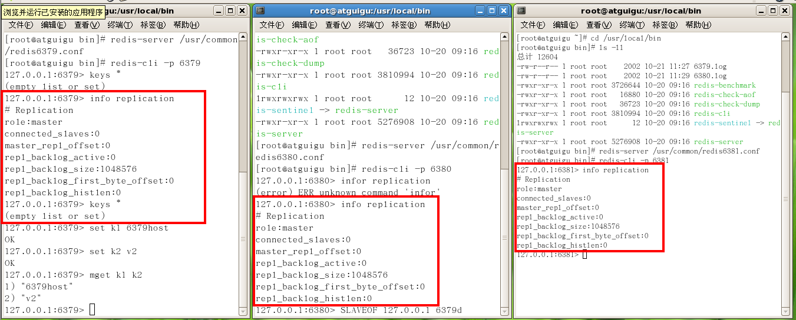

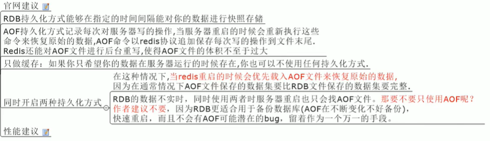

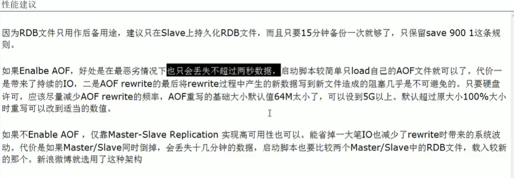

- AOF文件时一个只进行追加的日志文件
- Redis可以在AOF文件体积变得过大时，自动地在后台对AOF进行重写
- AOF文件有序地保存了对数据库执行的所有写入操作，这些写入操作以Redis协议的格式保存，因此AOF文件的内容非常容易被人读懂，对文件进行分析也很轻松
- 对于相同的数据集来说，AOF文件的体积通常要大于RDB文件的体积
- 根据所使用的fsync 策略，AOF的速度可能会慢于RDB


> **首先注意 usr 指 Unix System Resource，而不是user**
>
> **/usr/bin**
> **系统预装的一些可执行程序，随系统升级会改变**
>
> **/usr/local/bin**
> **用户安装的可执行程序，不受系统升级影响，用户编译安装软件时，一般放到/usr/local目录下**
>
> 如果两个目录下有相同的可执行程序，谁优先执行会受到PATH环境变量的影响，举个栗子：
> echo $PATH查看当前 PATH 环境变量
> /usr/local/sbin:/usr/local/bin:/usr/sbin:/usr/bin:/root/.local/bin:/root/bin:/usr/local/src/nodejs/bin:/usr/local/git/bin:/usr/bin/git/bin
> 这里 /usr/local/git/bin 优先于 /usr/bin/git/bin
>
> /bin 存放所有用户皆可用的系统程序，系统启动或者系统修复时可用（在没有挂载 /usr 目录时就可以使用）
>
> /sbin 存放超级用户才能使用的系统程序
>
> /usr/bin 存放所有用户都可用的应用程序
>
> /usr/sbin 存放超级用户才能使用的应用程序
>
> /usr/local/bin 存放所有用户都可用的与本地机器无关的程序
>
> /usr/local/sbin 存放超级用户才能使用的与本地机器无关的程序
>
> 原文链接：https://blog.csdn.net/LittlePoem/article/details/109510849


> **linux命令：free看内存，地df -h 看磁盘空间**


# 10. 主从复制模式(replication)


## 1. 是什么

行话：也就是我们所说的主从复制，**主机数据更新后根据配置和策略， 自动同步到备机的master/slaver机制，Master以写为主，Slave以读为主**


## 2. 能干嘛

- **读写分离**

  1、只有1个Master，可以有N个slaver，而且Slaver也可以有自己的Slaver，由于这种主从的关系决定他们是在配置阶段就要指定他们的上下级关系，而不是Zookeeper那种平行关系是自主推优出来的。

  2、 读写分离，Master只负责写和同步数据给Slaver，Slaver承担了被读的任务，所以 <u>**Slaver的扩容只能提高读效率不能提高写效率。**</u>

  3、 Slaver先将Master那边获取到的信息压入磁盘，再load进内存，client端是从内存中读取信息的，所以Redis是内存数据库。

  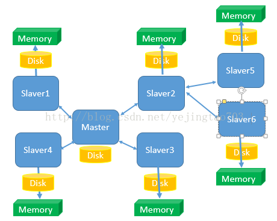

  ------------------------------------------------

  > 原文链接：https://blog.csdn.net/yejingtao703/article/details/78484151

- **容灾恢复**


当一个新的*Slaver*加入到这个集群时，会主动找*Master*来拜码头，*Master*发现新的小弟后将全量数据发送给新的*Slaver*，数据量越大性能消耗也就越大，所以尽量避免在运行时做*Slaver*的扩容。

**优缺点**

**优点**：读写分离，通过增加Slaver可以提高并发读的能力。

**缺点**：

- **Master写能力是瓶颈。** 
- 虽然理论上对Slaver没有限制但是维护Slaver开销总将会变成瓶颈。
- **<u>Master的Disk大小</u> 也将会成为整个Redis集群存储容量的瓶颈**。


   

> 原文链接：https://blog.csdn.net/yejingtao703/article/details/78484151

## 3. 怎么玩

### 1. 准备工作

✨**注意：因为是在同一台机器测试，需要配置三个不同的端口号**

**主机配置案例：**

```yaml
# mkdir -p /data/redis

# vim /usr/local/redis/redis.conf
#监听ip，多个ip用空格分隔
bind 192.168.30.128     
#允许后台启动
daemonize yes
#日志路径
logfile "/usr/local/redis/redis.log"        
#数据库备份文件存放目录
dir /data/redis
#slave连接master密码，master可省略
masterauth 123456       
#设置master连接密码，slave可省略
requirepass 123456              
#在/data/redis/（指定）目录生成appendonly.aof文件，将每一次写操作请求都追加到 appendonly.aof 文件中
appendonly yes               

# echo 'vm.overcommit_memory=1' >> /etc/sysctl.conf

# sysctl -p
```

**从机配置案例**

```yaml
# mkdir -p /data/redis

# vim /usr/local/redis/redis.conf

bind 192.168.30.129
daemonize yes
logfile "/usr/local/redis/redis.log"
dir /data/redis
#配置主机的ip地址和端口，避免重新启动后配置
replicaof 192.168.30.128 6379
masterauth 123456
requirepass 123456
appendonly yes

# echo 'vm.overcommit_memory=1' >> /etc/sysctl.conf

# sysctl -p
```

> 原文链接：https://blog.csdn.net/miss1181248983/article/details/90056960

**自己的配置文件已导出**

- **修改配置文件细节操作**
  
  - 拷贝多个redis.conf文件，按`redis[port].conf`重命名
  - 开启**daemonize yes**
    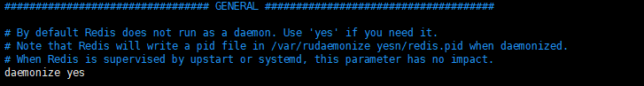
  - 设置bind，开放指定ip（测试可以不管）
    
  - pid文件名字(redis_端口号.pid)【redis6.0自动添加】
    ****
  - 指定端口
    
  - 修改log文件名字
    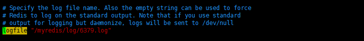
  - dump.rdb名字
    
  - **设置工作目录，即持久化文件所在的路径**
    
  - **主机设置redis服务密码**
    
  - **从机设置带备份主机的IP地址端口信息（避免重启重新配置）**
  - **从机设置待备份主机密码**
    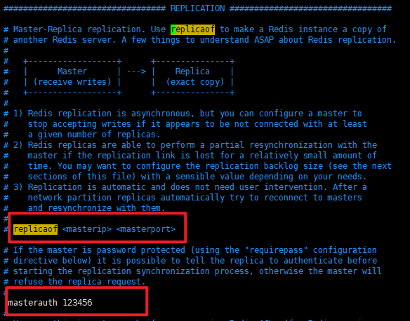
  
- **使用如下命令启动6379、6380、6381的客户端**

  > \# redis-server /myredis/redis端口号.conf
  > \# redis-cli -p 端口号

  - 6379客户端（master）
    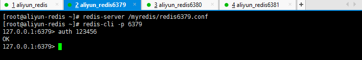
  - 6380客户端（slaver）
    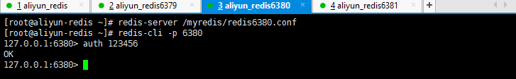
  - 6381客户端（slaver）
    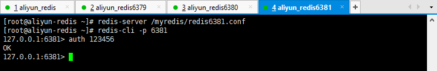

- **启动完成后查看进程**
  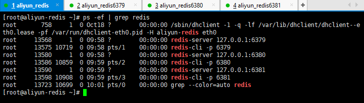


- **配从(库)不配主(库)**
- **从库配置命令：==slaveof 主库IP 主库端口**==
  - 每次与master断开之后，都需要重新连接，除非你配置进redis.conf文件（具体位置：redis.conf搜寻`#### REPLICATION ####`）|
    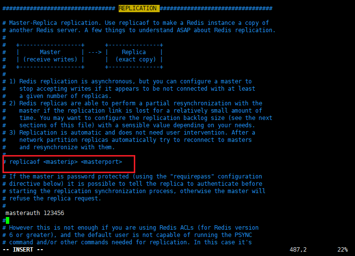
  - **`info replication`查看相关信息**


### 2. 常用3招

#### 1. 一主二仆

##### 1. 配置查看主从机

- **初始信息**
  - 6379主机master（写为主）
    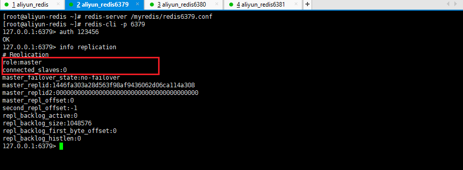
  - 6380从机slaver
    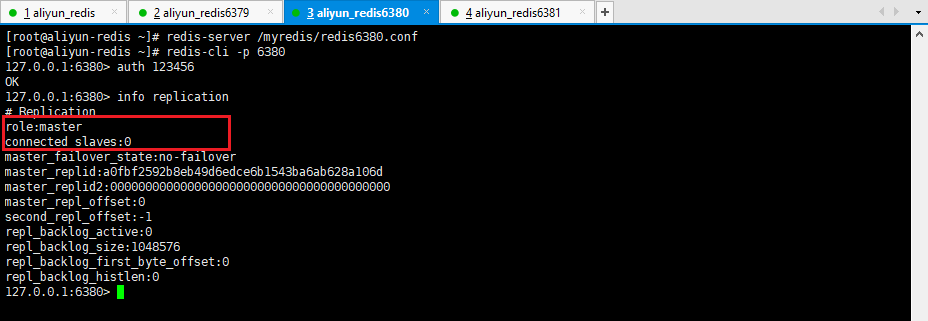
  - 6381从机slaver
    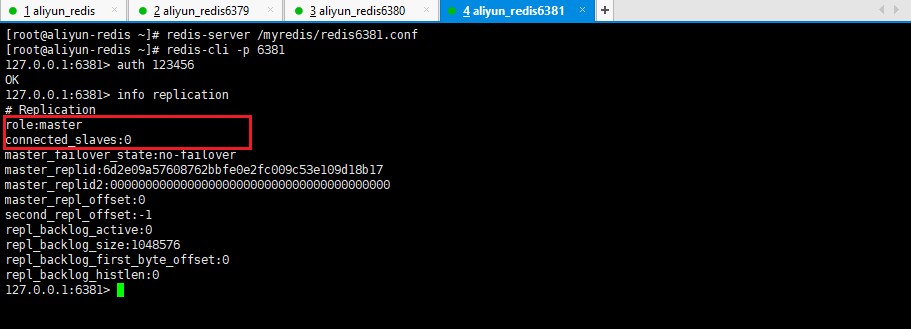

- **配置一个Master(主)，两个Slave(从)**
  - 6379主机master（写为主）
    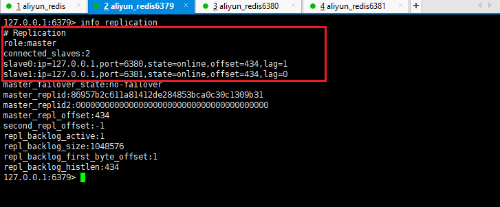
  - 6380从机slaver
    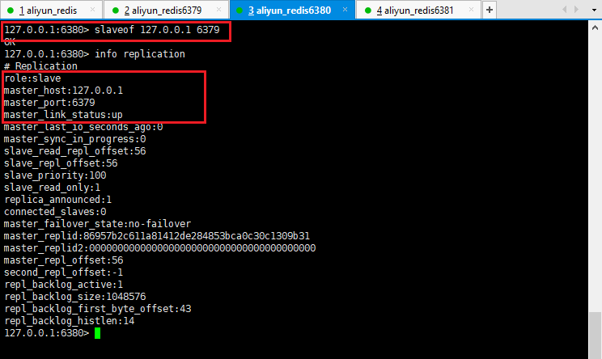
  - 6381从机slaver
    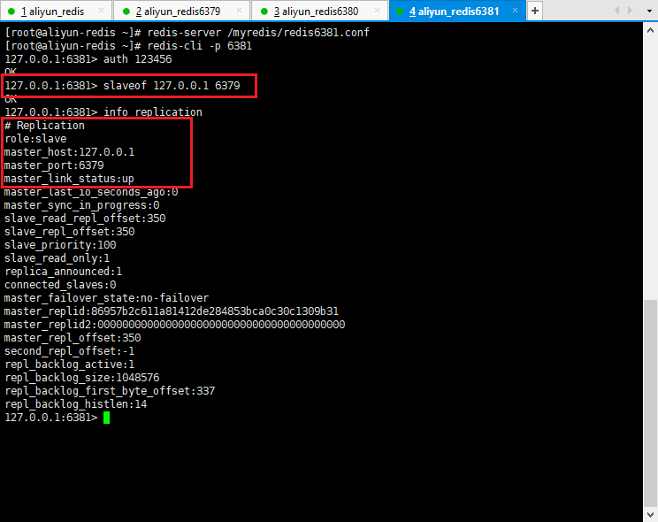

- **日志查看**
  - 主机日志 
    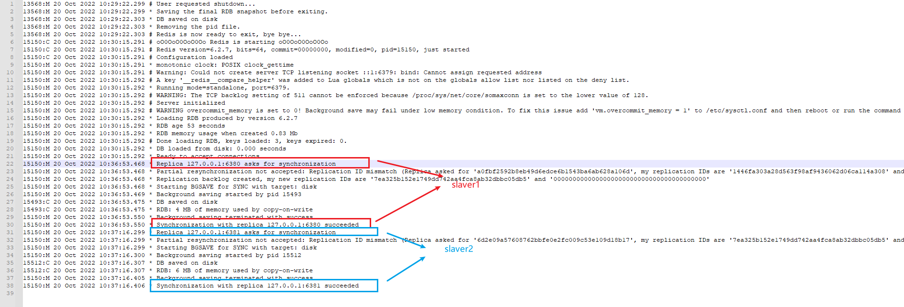
  - 备机日志 
    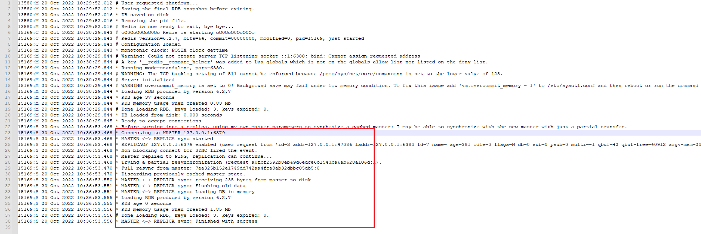


**redis查看配置文件的命令**

> ```
> 127.0.0.1:6380> config get dir
> 1) "dir"
> 2) "/myredis"
> 127.0.0.1:6380> config get dbfilename
> 1) "dbfilename"
> 2) "dump6380.rdb"
> 127.0.0.1:6380> 
> ```


##### 2. 主从问题演示

1、切入点问题？slave1、slave2是从头开始复制还是从切入点开始复制?比如从k4进来，那之前的k1、k2、k3是否也可以复制？
答：从头开始复制；k1、k2、k3也可以复制，并且是增量复制

2、从机是否可以写？
答：读写分离，主机可写，从机只读
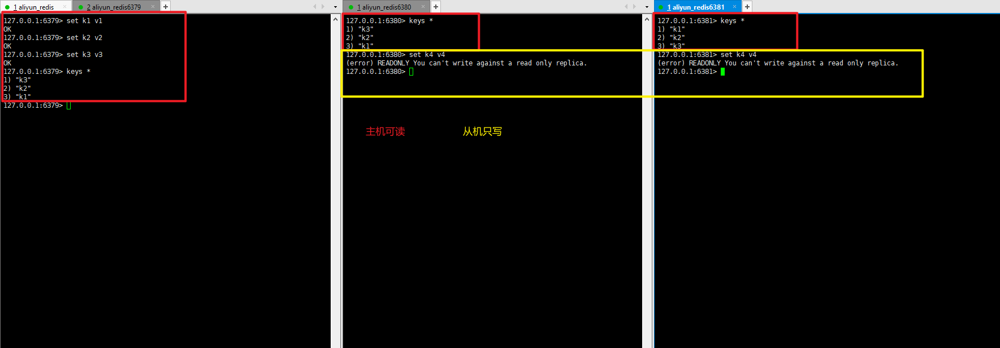

3、主机shutdown后情况如何？从机是上位还是原地待命
答：主机shutdown后，从机还是原地待命
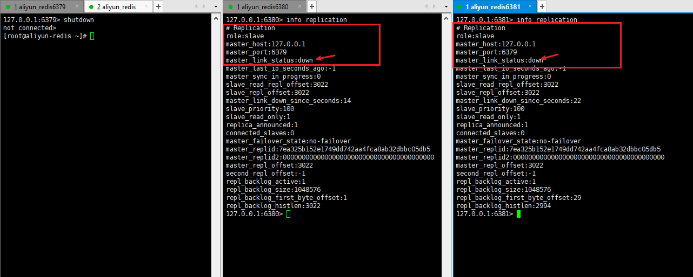


4、主机重新连接后，主机新增记录，从机还能否顺利复制？
答：能
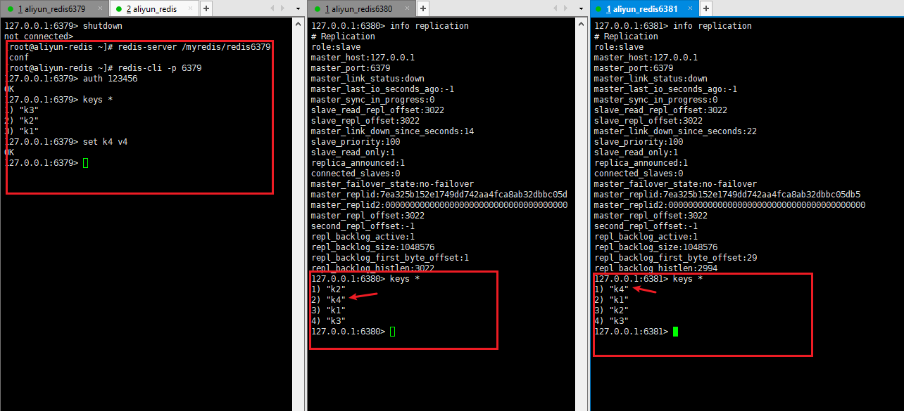


5、其中一台从机shutdown重新启动后情况如何？依照原有它能跟上大部队吗？
答：不能跟上，**每次与master断开之后，都需要重新连接（slaveof 主库ip 主库端口号）**，除非你配置进redis.conf文件（具体位置：redis.conf搜寻#### REPLICATION ####）
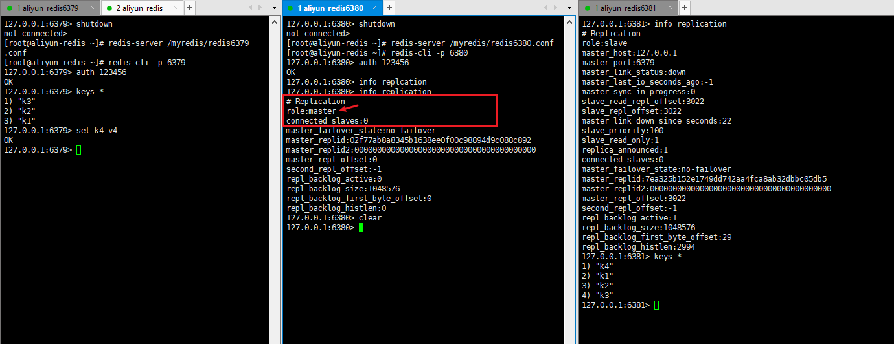


#### 2. 薪火相传

- 上一个Slave可以是下一个slave的Master，Slave同样可以接收其他 slaves的连接和同步请求，那么该slave作为了链条中下一个的master（还是slave）, 可以有效减轻master的写压力（奴隶的奴隶还是奴隶）

- 中途变更转向：**会清除之前的数据，重新建立拷贝最新的。**命令为：==slaveof 新主库IP 新主库端口==

  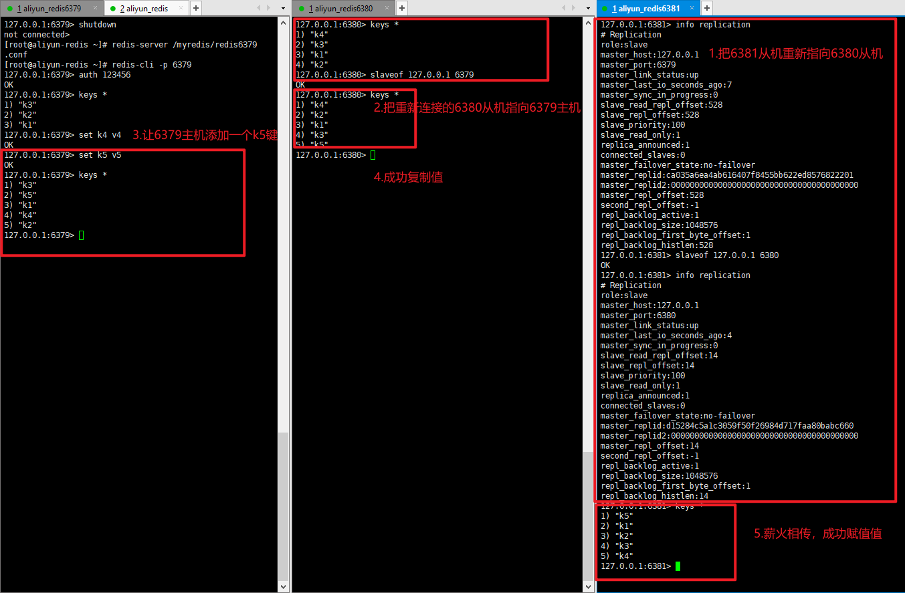

#### 3, 反客为主

- 对从机使用命令==`SLAVEOF no one`==使其成为新的主机
  - 使当前数据库停止与其他数据库的同步，转成主数据库
  
- 其他从机重新执行==`SLAVEOF 主机ip 主机端口号`==

  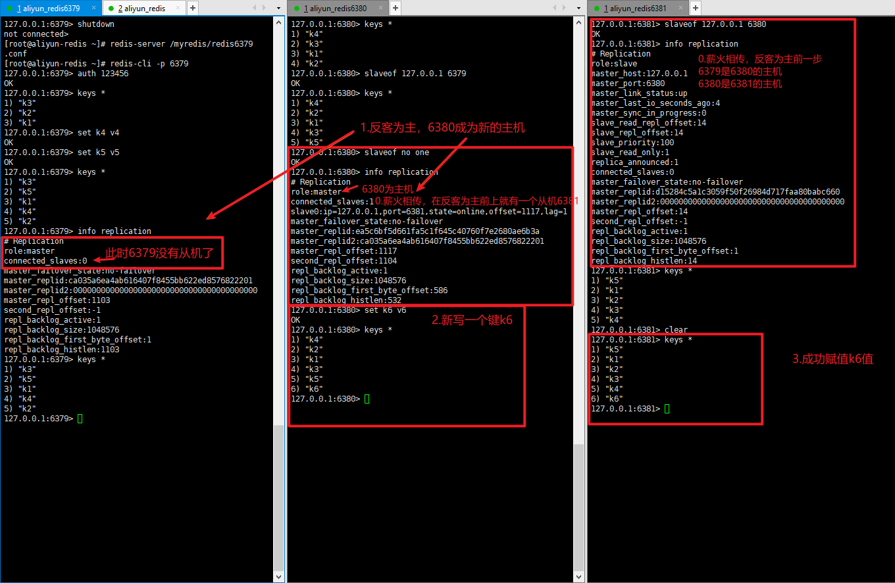


## 4. 复制原理

- slave启动成功连接到master后会发送一个sync命令
- master接到命令启动后台的存盘进程，同时收集所有接收到的用于修改数据集命令， 在后台进程执行完毕之后，master将传送整个数据文件到slave,以完成一次完全同步
- **全量复制**：而slave服务在接收到数据库文件数据后，将其存盘并加载到内存中。
- **增量复制**：Master继续将新的所有收集到的修改命令依次传给slave,完成同步
- 但是只要是重新连接master，一次完全同步（全量复制)将被自动执行
  


# 11. 哨兵模式(sentinel)


一组sentinel能同时监控多个master

## 1. 是什么

**反客为主的自动版，能够后台监控主机是否故障，如果故障了根据投票数自动将从库转换为主库**

主从模式的弊端就是不具备高可用性，当master挂掉以后，Redis将不能再对外提供写入操作，因此sentinel应运而生。

sentinel中文含义为哨兵，顾名思义，它的作用就是**监控redis集群的运行状况**，特点如下：

* sentinel模式是建立在主从模式的基础上，如果只有一个Redis节点，sentinel就没有任何意义

* 当master挂了以后，sentinel会在slave中选择一个做为master，并修改它们的配置文件，其他slave的配置文件也会被修改，比如slaveof属性会指向新的master

* 当master重新启动后，它将不再是master而是做为slave接收新的master的同步数据

* sentinel因为也是一个进程有挂掉的可能，所以sentinel也会启动多个形成一个sentinel集群

* 多sentinel配置的时候，sentinel之间也会自动监控

* 当主从模式配置密码时，sentinel也会同步将配置信息修改到配置文件中，不需要担心

* **一个sentinel或sentinel集群可以管理多个主从Redis，多个sentinel也可以监控同一个redis**

* sentinel最好不要和Redis部署在同一台机器，不然Redis的服务器挂了以后，sentinel也挂了

工作机制：

* 每个sentinel以每秒钟一次的频率向它所知的master，slave以及其他sentinel实例发送一个 PING 命令 

* 如果一个实例距离最后一次有效回复 PING 命令的时间超过 down-after-milliseconds 选项所指定的值， 则这个实例会被sentinel标记为主观下线。 

* 如果一个master被标记为主观下线，则正在监视这个master的所有sentinel要以每秒一次的频率确认master的确进入了主观下线状态

* 当有足够数量的sentinel（大于等于配置文件指定的值）在指定的时间范围内确认master的确进入了主观下线状态， 则master会被标记为客观下线 

* 在一般情况下， 每个sentinel会以每 10 秒一次的频率向它已知的所有master，slave发送 INFO 命令 

* 当master被sentinel标记为客观下线时，sentinel向下线的master的所有slave发送 INFO 命令的频率会从 10 秒一次改为 1 秒一次 

* 若没有足够数量的sentinel同意master已经下线，master的客观下线状态就会被移除；
  若master重新向sentinel的 PING 命令返回有效回复，master的主观下线状态就会被移除

**✨当使用sentinel模式的时候，客户端就不要直接连接Redis，而是连接sentinel的ip和port，由sentinel来提供具体的可提供服务的Redis实现**，这样当master节点挂掉以后，sentinel就会感知并将新的master节点提供给使用者。

> 原文链接：https://blog.csdn.net/miss1181248983/article/details/90056960

Sentinel模式下的几个事件：

·       +reset-master ：主服务器已被重置。

·       +slave ：一个新的从服务器已经被 Sentinel 识别并关联。

·       +failover-state-reconf-slaves ：故障转移状态切换到了 reconf-slaves 状态。

·       +failover-detected ：另一个 Sentinel 开始了一次故障转移操作，或者一个从服务器转换成了主服务器。

·       +slave-reconf-sent ：领头（leader）的 Sentinel 向实例发送了 [SLAVEOF](/commands/slaveof.html) 命令，为实例设置新的主服务器。

·       +slave-reconf-inprog ：实例正在将自己设置为指定主服务器的从服务器，但相应的同步过程仍未完成。

·       +slave-reconf-done ：从服务器已经成功完成对新主服务器的同步。

·       -dup-sentinel ：对给定主服务器进行监视的一个或多个 Sentinel 已经因为重复出现而被移除 —— 当 Sentinel 实例重启的时候，就会出现这种情况。

·       +sentinel ：一个监视给定主服务器的新 Sentinel 已经被识别并添加。

·       +sdown ：给定的实例现在处于主观下线状态。

·       -sdown ：给定的实例已经不再处于主观下线状态。

·       +odown ：给定的实例现在处于客观下线状态。

·       -odown ：给定的实例已经不再处于客观下线状态。

·       +new-epoch ：当前的纪元（epoch）已经被更新。

·       +try-failover ：一个新的故障迁移操作正在执行中，等待被大多数 Sentinel 选中（waiting to be elected by the majority）。

·       +elected-leader ：赢得指定纪元的选举，可以进行故障迁移操作了。

·       +failover-state-select-slave ：故障转移操作现在处于 select-slave 状态 —— Sentinel 正在寻找可以升级为主服务器的从服务器。

·       no-good-slave ：Sentinel 操作未能找到适合进行升级的从服务器。Sentinel 会在一段时间之后再次尝试寻找合适的从服务器来进行升级，又或者直接放弃执行故障转移操作。

·       selected-slave ：Sentinel 顺利找到适合进行升级的从服务器。

·       failover-state-send-slaveof-noone ：Sentinel 正在将指定的从服务器升级为主服务器，等待升级功能完成。

·       failover-end-for-timeout ：故障转移因为超时而中止，不过最终所有从服务器都会开始复制新的主服务器（slaves will eventually be configured to replicate with the new master anyway）。

·       failover-end ：故障转移操作顺利完成。所有从服务器都开始复制新的主服务器了。

·       +switch-master ：配置变更，主服务器的 IP 和地址已经改变。 这是绝大多数外部用户都关心的信息。

·       +tilt ：进入 tilt 模式。

·       -tilt ：退出 tilt 模式。

版权声明：本文为CSDN博主「最爱喝酸奶」的原创文章，遵循CC 4.0 BY-SA版权协议，转载请附上原文出处链接及本声明。
原文链接：https://blog.csdn.net/miss1181248983/article/details/90056960


## 2. 怎么玩(使用步骤)

**sentinel案例：**

```yaml
 # vim /usr/local/redis/sentinel.conf
 
 daemonize yes
 logfile "/usr/local/redis/sentinel.log"
 #sentinel配置文件的目录，sentinel工作目录
 dir "/usr/local/redis/sentinel"                
 #判断master失效至少需要2个sentinel同意，建议设置为n/2+1，n为sentinel个数
 #sentinel monitor 被监控数据库名字(自己起名字) ip地址 端口号 n(判断master失效的票数)
 sentinel monitor mymaster 192.168.30.128 6379 2       
 #mymaster为被监控数据库名字(自己起名字)
 sentinel auth-pass mymaster 123456
 #mymaster为被监控数据库名字(自己起名字)
 #判断master主观下线时间，默认30s
 sentinel down-after-milliseconds mymaster 30000                 
```

这里需要注意，`sentinel auth-pass mymaster 123456`需要配置在`sentinel monitor mymaster 192.168.30.128 6379 2`下面，否则启动报错：

```yaml
# /usr/local/bin/redis-sentinel /usr/local/redis/sentinel.conf

*** FATAL CONFIG FILE ERROR ***
Reading the configuration file, at line 104
>>> 'sentinel auth-pass mymaster 123456'
No such master with specified name.

```


**步骤：**

1. 调整结构，6379主机带着6380、6381两个从机

2. 新建**sentinel.conf** 文件，名字绝不能错

3. 配置 **sentinel.conf** 文件实例,填写内容 

    ```yaml
    daemonize yes
    logfile "/myredis/log/sentinel.log"
    dir "/myredis"
    sentinel monitor host6379 127.0.0.1 6379 1
    sentinel auth-pass host6379 123456
    sentinel down-after-milliseconds host6379 10000
    ```

    

4. **启动哨兵**

   - ✨==redis-sentinel /myredis/sentinel.conf==（上述目录依照各自的实际情况配置，可能目录不同）

      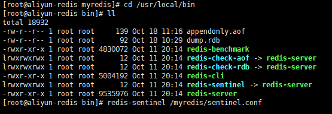
     
   - 启动后再次查看 **sentinel.conf** 文件，自动生成如下默认配置

     ```yaml
     daemonize yes
     logfile "/myredis/sentinel.log"
     dir "/myredis"
     sentinel monitor host6379 127.0.0.1 6379 1
     sentinel auth-pass host6379 123456
     sentinel down-after-milliseconds host6379 10000
     # Generated by CONFIG REWRITE
     protected-mode no
     pidfile "/var/run/redis.pid"
     port 26379
     user default on nopass ~* &* +@all
     sentinel myid 4f92e4cba3ef610eebc8c7f318e9b9756c01a480
     sentinel config-epoch host6379 0
     sentinel leader-epoch host6379 0
     sentinel current-epoch 0
     sentinel known-replica host6379 127.0.0.1 6381
     sentinel known-replica host6379 127.0.0.1 6380
     ```

     

5. **查看任一哨兵主机的 sentinel.log 日志**

   ```yaml
   # vim /myredis/sentinel.log
   
   31826:X 20 Oct 2022 16:06:42.437 # oO0OoO0OoO0Oo Redis is starting oO0OoO0OoO0Oo
   31826:X 20 Oct 2022 16:06:42.437 # Redis version=6.2.7, bits=64, commit=00000000, modified=0, pid=31826, just started
   31826:X 20 Oct 2022 16:06:42.437 # Configuration loaded
   31826:X 20 Oct 2022 16:06:42.438 * monotonic clock: POSIX clock_gettime
   31826:X 20 Oct 2022 16:06:42.438 # A key '__redis__compare_helper' was added to Lua globals which is not on the globals allow list nor listed on the deny list.
   31826:X 20 Oct 2022 16:06:42.438 * Running mode=sentinel, port=26379.
   31826:X 20 Oct 2022 16:06:42.438 # WARNING: The TCP backlog setting of 511 cannot be enforced because /proc/sys/net/core/somaxconn is set to the lower value of 128.
   31826:X 20 Oct 2022 16:06:42.446 # Sentinel ID is 4f92e4cba3ef610eebc8c7f318e9b9756c01a480
   31826:X 20 Oct 2022 16:06:42.446 # +monitor master host6379 127.0.0.1 6379 quorum 1
   31826:X 20 Oct 2022 16:06:42.447 * +slave slave 127.0.0.1:6380 127.0.0.1 6380 @ host6379 127.0.0.1 6379
   31826:X 20 Oct 2022 16:06:42.454 * +slave slave 127.0.0.1:6381 127.0.0.1 6381 @ host6379 127.0.0.1 6379
   ```

   

6. **原有的master宕机演示**

7. 投票新选
   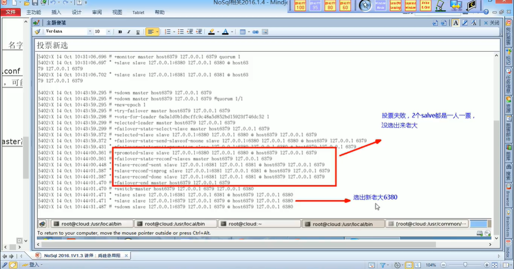

8. 重新主从继续开工，原来的master编程slave，使用`info replication`命令查看


## 3. 复制的缺点

**复制延时**

由于所有的写操作都是先在Master上操作，然后同步更新到slave上，所以从Master同步到Slave机器有一定的延迟，当系统很繁忙的时候，延迟问题会更加严重，Slave机器数量的增加也会使这个问题更加严重。


# 12. 集群模式

## 0. 来源

*Redis*集群设计包括*2*部分：哈希*Slot*和节点主从，本篇博文通过*3*张图来搞明白*Redis*的集群设计。

### 1. 节点主从

主从设计不算什么新鲜玩意，在数据库中我们也经常用主从来做读写分离，直接上图：


图上能看得到的信息：

1、只有1个Master，可以有N个slaver，而且Slaver也可以有自己的Slaver，由于这种主从的关系决定他们是在配置阶段就要指定他们的上下级关系，而不是Zookeeper那种平行关系是自主推优出来的。

2、 读写分离，Master只负责写和同步数据给Slaver，Slaver承担了被读的任务，所以 <u>**Slaver的扩容只能提高读效率不能提高写效率。**</u>

3、 Slaver先将Master那边获取到的信息压入磁盘，再load进内存，client端是从内存中读取信息的，所以Redis是内存数据库。

当一个新的Slaver加入到这个集群时，会主动找Master来拜码头，Master发现新的小弟后将全量数据发送给新的Slaver，数据量越大性能消耗也就越大，所以尽量避免在运行时做Slaver的扩容。


**简单总结下主从模式的设计：**

优点：读写分离，通过增加Slaver可以提高并发读的能力。

缺点：

- **Master写能力是瓶颈。** 
- 虽然理论上对Slaver没有限制但是维护Slaver开销总将会变成瓶颈。
- **<u>Master的Disk大小</u> 也将会成为整个Redis集群存储容量的瓶颈**。


> 原文链接：https://blog.csdn.net/yejingtao703/article/details/78484151


### **2. 哈希Slot**

这个艺名看起来很文艺，但也不是什么新技术，他的真名就叫分表分库，再上一个图：

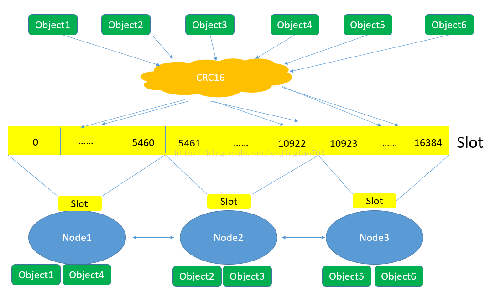


图上能看到的信息：

1、 **对象保存到Redis之前先经过 <u>CRC16</u> 哈希到一个指定的Node上，例如Object4最终Hash到了Node1上。**

2 、 **每个Node被平均分配了一个Slot段，对应着0-16384，<u>Slot不能重复也不能缺失</u>，否则会导致对象重复存储或无法存储。**

3、Node之间也互相监听，一旦有Node退出或者加入，会按照Slot为单位做数据的迁移。**例如Node1如果掉线了，0-5640这些Slot将会平均分摊到Node2和Node3上,由于Node2和Node3本身维护的Slot还会在自己身上不会被重新分配，所以迁移过程中不会影响到5641-16384Slot段的使用。


**缺点**：每个Node承担着互相监听、高并发数据写入、高并发数据读出，工作任务繁重

**优点**：将Redis的写操作分摊到了多个节点上，提高写的并发能力，扩容简单。

> 原文链接：https://blog.csdn.net/yejingtao703/article/details/78484151


## 1.介绍✨

✨✨✨

**sentinel模式基本可以满足一般生产的需求，具备高可用性。但是当 <u>数据量过大到一台服务器存放不下的情况</u> 时，主从模式或sentinel模式就不能满足需求了，这个时候需要 <u>对存储的数据进行==分片==</u>，将数据存储到多个Redis实例中。**

**cluster模式的出现就是为了解决单机Redis容量有限的问题，将Redis的数据根据一定的规则分配到多台机器。**

**cluster可以说是sentinel和主从模式的结合体，通过cluster可以实现 <u>主从和master重选</u> 功能，所以如果配置两个副本三个分片的话，就需要六个Redis实例。**因为**Redis的数据是根据一定规则分配到cluster的不同机器**的，当数据量过大时，可以新增机器进行扩容。

使用集群，只需要 <u>**将redis配置文件中的cluster-enable配置打开**</u> 即可。**每个集群中至少需要==三个主数据库==才能正常运行，新增节点非常方便。**

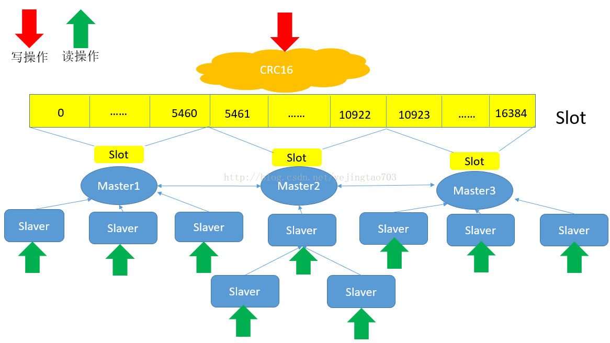

想扩展并发读就添加*Slaver*，想扩展并发写就添加*Master*，想扩容也就是添加*Master*，任何一个*Slaver*或者几个*Master*挂了都不会是灾难性的故障。

---

**cluster集群特点：**

* 多个redis节点网络互联，数据共享

* 所有的节点都是一主一从（也可以是一主多从），其中从不提供服务，仅作为备用

* 不支持同时处理多个key（如MSET/MGET），因为redis需要把key均匀分布在各个节点上，并发量很高的情况下同时创建key-value会降低性能并导致不可预测的行为
  
* 支持在线增加、删除节点

* 客户端可以连接任何一个主节点进行读写

> 原文链接：https://blog.csdn.net/miss1181248983/article/details/90056960


## 2.  使用步骤

### 0. 环境准备


#### 1. 删除持久化数据

**将rdb,aof文件都删除掉**

主服务：6379、6380、6381

从服务：6389、6390、6391

#### 2. 制作6个实例

✨**注意：因为是在同一台机器测试，需要配置六个不同的端口号**

 

##### 1. 配置基本信息

- **修改配置文件细节操作**
  - 拷贝多个redis.conf文件，按`redis[port].conf`重命名
  - 开启**daemonize yes**
    
  - 设置bind，开放指定ip（监听ip，多个ip用空格分隔）
    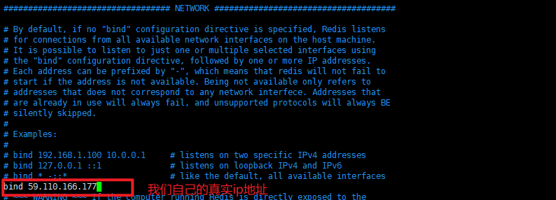
  - protected-mode 改为no
    
  - pid文件名字(redis==_端口==号.pid)【redis6.0自动添加】
    ****
  - 指定==端口==
    
  - 修改log文件名字（==端口号==）,并设置其保存路径
    
  - dump.rdb名字（==端口号==）
    
  - **设置工作目录，即持久化文件所在的路径**
    
  - **主机设置redis服务密码**
    
  - **从机设置待备份主机的IP地址端口信息（避免重启重新配置）**
  - **从机设置待备份主机密码**
    
  - **applendonly** 关闭或者换名字，这里是关闭
    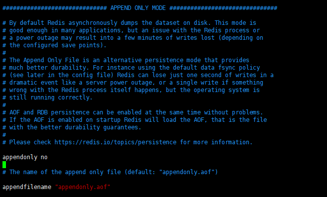

##### 2. 配置redis cluster信息

**修改配置文件细节操作**

- cluster-enable yes 打开集群模式
- cluster-config-file nodes-6379.conf 设置节点配置文件名（redis6自动设置，nodes-==端口号==.conf【路径为该服务配置文件的位置】）
- cluster-node-timeout 设置节点失联时间，超过该时间（ms）集群自动进行主从切换
  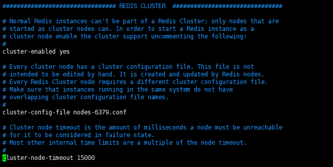

新建6个同样的配置文件，更改端口号即可
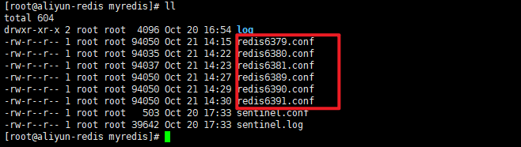

> **命令模式使用 %s/a/b：把a批量替换成b**


##### 3. 启动6个redis服务

**记得关闭掉 sentinel 服务**

✨**启动服务后自动在该服务配置文件（redisXxxx.conf）的目录下自动生成节点配置文件**

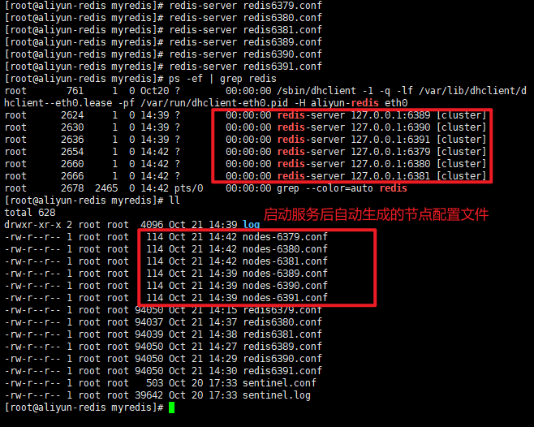

> **✨注意：`replicaof`指定不允许在集群模式中使用**
> 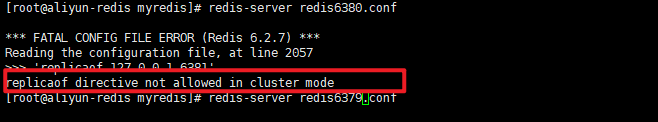


##### ==4. 将6个节点合成一个集群==

✨组合之前，请确保 **所有的redis实例启动** 后，**nodes-xxxx.conf文件** 都生成正常
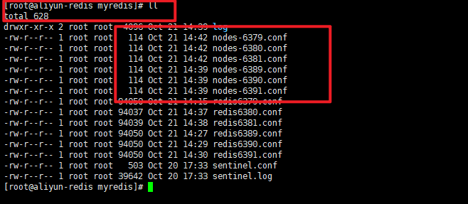


###### 1. **安装ruby（低版本）**

如果redis版本比较低，则需要安装ruby。任选一台机器安装ruby即可

进入redis解压目录的 src 目录下：`cd  /opt/redis-6.2.7/src`中
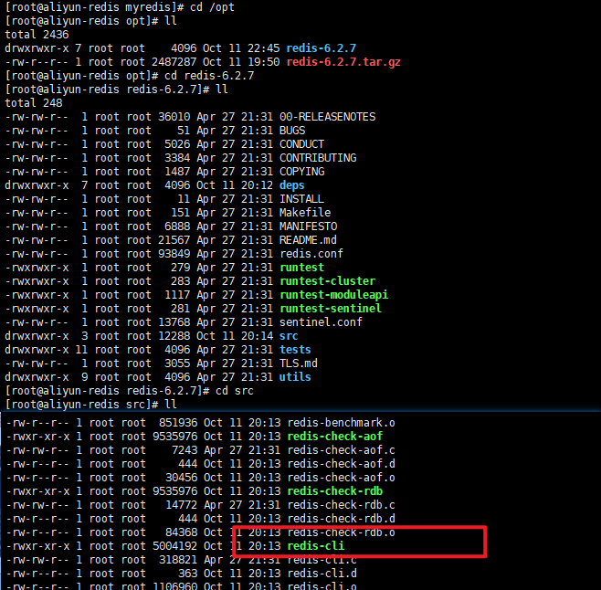


###### ==2. **创建集群**✨==

使用`redis-cli -a 123456 --cluster create --cluster-replicas 1 主机ip:端口号`

```yaml
# redis-cli -a 123456 --cluster create --cluster-replicas 1 59.110.166.177:6379 59.110.166.177:6380 59.110.166.177:6381 59.110.166.177:6389 59.110.166.177:6390 59.110.166.177:6391
```

>✨**注意：**
>
>**此处使用真实ip地址。其中**
>
>- **<u>--cluster create 参数表示要初始化集群</u>**
>- **<u>--replicas 1表示使用简单的方式配置集群，每个主数据库拥有的从数据库个数为1</u>，所以整个集群共有3（6/2）个主数据库以及3个从数据库。**
>- **<u>-a 123456 表示redis实例认证的密码</u>**


✨✨✨**配置案例（以下均为案例，自己配置失败）**

```yaml
# redis-cli -a 123456 --cluster create 192.168.30.128:7001 192.168.30.128:7002 192.168.30.129:7003 192.168.30.129:7004 192.168.30.130:7005 192.168.30.130:7006 --cluster-replicas 1

Warning: Using a password with '-a' or '-u' option on the command line interface may not be safe.
>>> Performing hash slots allocation on 6 nodes...
Master[0] -> Slots 0 - 5460
Master[1] -> Slots 5461 - 10922
Master[2] -> Slots 10923 - 16383
Adding replica 192.168.30.129:7004 to 192.168.30.128:7001
Adding replica 192.168.30.130:7006 to 192.168.30.129:7003
Adding replica 192.168.30.128:7002 to 192.168.30.130:7005
M: 80c80a3f3e33872c047a8328ad579b9bea001ad8 192.168.30.128:7001
   slots:[0-5460] (5461 slots) master
S: b4d3eb411a7355d4767c6c23b4df69fa183ef8bc 192.168.30.128:7002
   replicates 6788453ee9a8d7f72b1d45a9093838efd0e501f1
M: 4d74ec66e898bf09006dac86d4928f9fad81f373 192.168.30.129:7003
   slots:[5461-10922] (5462 slots) master
S: b6331cbc986794237c83ed2d5c30777c1551546e 192.168.30.129:7004
   replicates 80c80a3f3e33872c047a8328ad579b9bea001ad8
M: 6788453ee9a8d7f72b1d45a9093838efd0e501f1 192.168.30.130:7005
   slots:[10923-16383] (5461 slots) master
S: 277daeb8660d5273b7c3e05c263f861ed5f17b92 192.168.30.130:7006
   replicates 4d74ec66e898bf09006dac86d4928f9fad81f373
Can I set the above configuration? (type 'yes' to accept): yes 
#输入yes，接受上面配置
>>> Nodes configuration updated
>>> Assign a different config epoch to each node
>>> Sending CLUSTER MEET messages to join the cluster
```


**结构如下图：**
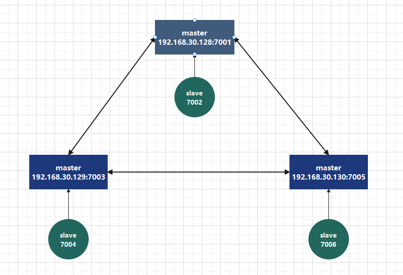


### 1. -c 采用集群策略登录集群

设置数据会自动切换到对应的写主机

**登录集群：**

```yaml
# redis-cli -c -h 192.168.30.128 -p 7001 -a 123456                  # -c，使用集群方式登录
```

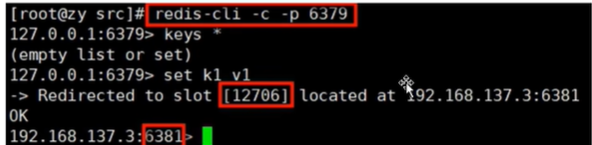


### 2. 查看集群和节点的信息

**通过 ==cluster info== 查看集群信息：**

```yaml
192.168.30.128:7001> CLUSTER INFO                   

#集群状态
cluster_state:ok
cluster_slots_assigned:16384
cluster_slots_ok:16384
cluster_slots_pfail:0
cluster_slots_fail:0
cluster_known_nodes:6
cluster_size:3
cluster_current_epoch:6
cluster_my_epoch:1
cluster_stats_messages_ping_sent:580
cluster_stats_messages_pong_sent:551
cluster_stats_messages_sent:1131
cluster_stats_messages_ping_received:546
cluster_stats_messages_pong_received:580
cluster_stats_messages_meet_received:5
cluster_stats_messages_received:1131
```


✨**通过 ==cluster nodes== 命令查看节点信息【这里与nodes.conf文件内容相同】：**

此时能知道每个节点的 id值 【方便后续 **<u>更改节点身份</u>** 和 **删除节点**】

```yaml
192.168.30.128:7001> CLUSTER NODES                  #列出节点信息

6788453ee9a8d7f72b1d45a9093838efd0e501f1 192.168.30.130:7005@17005 master - 0 1557455176000 5 connected 10923-16383
277daeb8660d5273b7c3e05c263f861ed5f17b92 192.168.30.130:7006@17006 slave 4d74ec66e898bf09006dac86d4928f9fad81f373 0 1557455174000 6 connected
b4d3eb411a7355d4767c6c23b4df69fa183ef8bc 192.168.30.128:7002@17002 slave 6788453ee9a8d7f72b1d45a9093838efd0e501f1 0 1557455175000 5 connected
80c80a3f3e33872c047a8328ad579b9bea001ad8 192.168.30.128:7001@17001 myself,master - 0 1557455175000 1 connected 0-5460
b6331cbc986794237c83ed2d5c30777c1551546e 192.168.30.129:7004@17004 slave 80c80a3f3e33872c047a8328ad579b9bea001ad8 0 1557455174989 4 connected
4d74ec66e898bf09006dac86d4928f9fad81f373 192.168.30.129:7003@17003 master - 0 1557455175995 3 connected 5461-10922
```


### 3. 操作数据

#### 1. 写入数据

- **写入数据：**

  ```yaml
  192.168.30.128:7001> set key111 aaa
  -> Redirected to slot [13680] located at 192.168.30.130:7005                
  #说明数据到了192.168.30.130:7005上
  OK
  
  192.168.30.130:7005> set key222 bbb
  -> Redirected to slot [2320] located at 192.168.30.128:7001                
  #说明数据到了192.168.30.128:7001上
  OK
  
  192.168.30.128:7001> set key333 ccc
  -> Redirected to slot [7472] located at 192.168.30.129:7003                 
  #说明数据到了192.168.30.129:7003上
  OK
  
  192.168.30.129:7003> get key111
  -> Redirected to slot [13680] located at 192.168.30.130:7005
  "aaa"
  
  192.168.30.130:7005> get key333
  -> Redirected to slot [7472] located at 192.168.30.129:7003
  "ccc"
  
  192.168.30.129:7003> 
  
  ```

  可以看出redis cluster集群是去中心化的，每个节点都是平等的，连接哪个节点都可以获取和设置数据。

  当然，平等指的是master节点，因为slave节点根本不提供服务，只是作为对应master节点的一个备份。


#### 2. 增加节点

##### 1. 配置新redis实例

**192.168.30.129上增加一个redis实例，该实例配置类：**

```yaml
# cp /usr/local/redis/cluster/redis_7003.conf /usr/local/redis/cluster/redis_7007.conf

  # vim /usr/local/redis/cluster/redis_7007.conf

bind 192.168.30.129
port 7007
daemonize yes
pidfile "/var/run/redis_7007.pid"
logfile "/usr/local/redis/cluster/redis_7007.log"
dir "/data/redis/cluster/redis_7007"
#replicaof 192.168.30.129 6379
masterauth "123456"
requirepass "123456"
appendonly yes
cluster-enabled yes
cluster-config-file nodes_7007.conf
cluster-node-timeout 15000

# mkdir /data/redis/cluster/redis_7007

# chown -R redis:redis /usr/local/redis && chown -R redis:redis /data/redis

# redis-server /usr/local/redis/cluster/redis_7007.conf 

```


**192.168.30.130上增加一个redis实例，该实例配置类：**

```yaml
# cp /usr/local/redis/cluster/redis_7005.conf /usr/local/redis/cluster/redis_7008.conf

# vim /usr/local/redis/cluster/redis_7007.conf

bind 192.168.30.130
port 7008
daemonize yes
pidfile "/var/run/redis_7008.pid"
logfile "/usr/local/redis/cluster/redis_7008.log"
dir "/data/redis/cluster/redis_7008"
#replicaof 192.168.30.130 6379
masterauth "123456"
requirepass "123456"
appendonly yes
cluster-enabled yes
cluster-config-file nodes_7008.conf
cluster-node-timeout 15000

# mkdir /data/redis/cluster/redis_7008

# chown -R redis:redis /usr/local/redis && chown -R redis:redis /data/redis

# redis-server /usr/local/redis/cluster/redis_7008.conf 

```


**结构如图所示：**
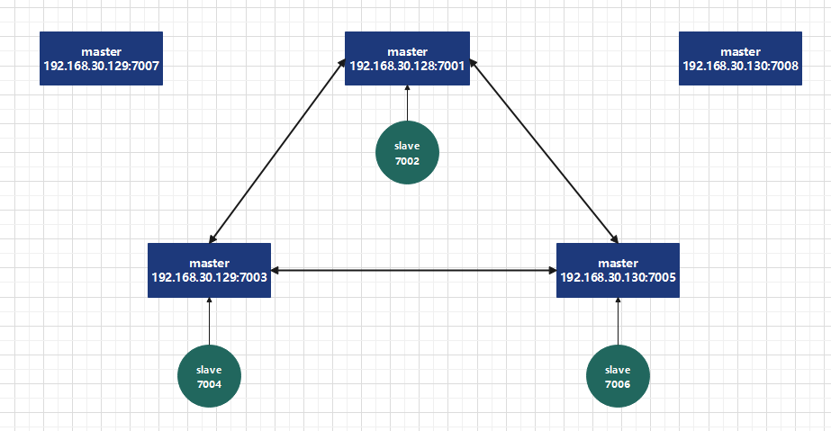


##### 2. 向集群中增加节点

<u>**集群中增加节点：==CLUSTER MEET 192.168.30.129【ip地址】 7007【端口号】==**</u>

```yaml
192.168.30.129:7003> CLUSTER MEET 192.168.30.129 7007
OK

#查看节点信息
192.168.30.129:7003> CLUSTER NODES

4d74ec66e898bf09006dac86d4928f9fad81f373 192.168.30.129:7003@17003 myself,master - 0 1557457361000 3 connected 5461-10922
80c80a3f3e33872c047a8328ad579b9bea001ad8 192.168.30.128:7001@17001 master - 0 1557457364746 1 connected 0-5460
277daeb8660d5273b7c3e05c263f861ed5f17b92 192.168.30.130:7006@17006 slave 4d74ec66e898bf09006dac86d4928f9fad81f373 0 1557457362000 6 connected
b6331cbc986794237c83ed2d5c30777c1551546e 192.168.30.129:7004@17004 slave 80c80a3f3e33872c047a8328ad579b9bea001ad8 0 1557457363000 4 connected
b4d3eb411a7355d4767c6c23b4df69fa183ef8bc 192.168.30.128:7002@17002 slave 6788453ee9a8d7f72b1d45a9093838efd0e501f1 0 1557457362000 5 connected
e51ab166bc0f33026887bcf8eba0dff3d5b0bf14 192.168.30.129:7007@17007 master - 0 1557457362729 0 connected
6788453ee9a8d7f72b1d45a9093838efd0e501f1 192.168.30.130:7005@17005 master - 0 1557457363739 5 connected 10923-16383

```


****<u>**集群中增加节点：==CLUSTER MEET 192.168.30.129 7008==**</u>**

```yaml
192.168.30.129:7003> CLUSTER MEET 192.168.30.130 7008
OK

192.168.30.129:7003> CLUSTER NODES

4d74ec66e898bf09006dac86d4928f9fad81f373 192.168.30.129:7003@17003 myself,master - 0 1557457489000 3 connected 5461-10922
80c80a3f3e33872c047a8328ad579b9bea001ad8 192.168.30.128:7001@17001 master - 0 1557457489000 1 connected 0-5460
277daeb8660d5273b7c3e05c263f861ed5f17b92 192.168.30.130:7006@17006 slave 4d74ec66e898bf09006dac86d4928f9fad81f373 0 1557457489000 6 connected
b6331cbc986794237c83ed2d5c30777c1551546e 192.168.30.129:7004@17004 slave 80c80a3f3e33872c047a8328ad579b9bea001ad8 0 1557457488000 4 connected
b4d3eb411a7355d4767c6c23b4df69fa183ef8bc 192.168.30.128:7002@17002 slave 6788453ee9a8d7f72b1d45a9093838efd0e501f1 0 1557457489472 5 connected
1a1c7f02fce87530bd5abdfc98df1cffce4f1767 192.168.30.130:7008@17008 master - 0 1557457489259 0 connected
e51ab166bc0f33026887bcf8eba0dff3d5b0bf14 192.168.30.129:7007@17007 master - 0 1557457489000 0 connected
6788453ee9a8d7f72b1d45a9093838efd0e501f1 192.168.30.130:7005@17005 master - 0 1557457490475 5 connected 10923-16383

```

**✨可以看到，新增的节点都是以master身份加入集群的**

**结构如图所示：**
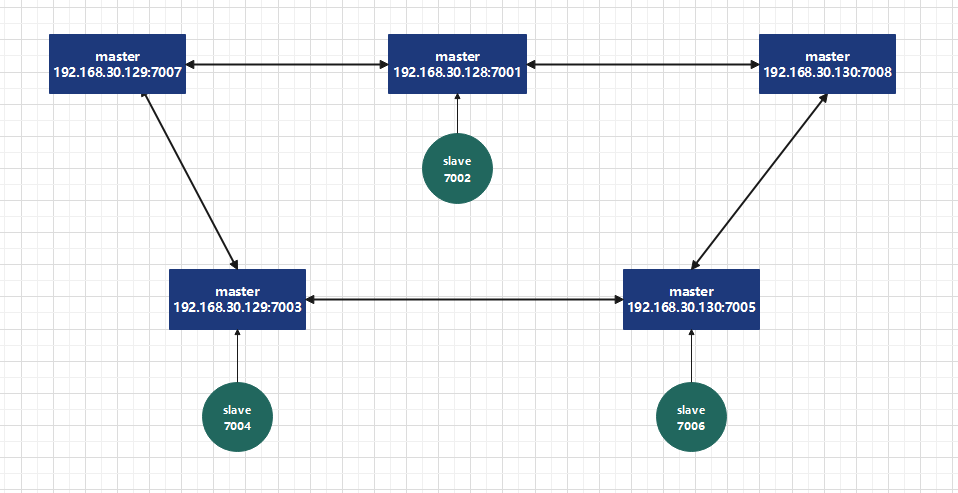


#### 3. 更换节点身份

**更换节点身份：将新增的<u>192.168.30.130:7008节点身份改为192.168.30.129:7007的slave</u>**

==CLUSTER REPLICATE e51ab166bc0f33026887bcf8eba0dff3d5b0bf14【`cluster replicate`后面跟node_id，更改对应节点身份】==

也可以登入集群更改

```yaml
# redis-cli -c -h 192.168.30.130 -p 7008 -a 123456

192.168.30.130:7008> CLUSTER REPLICATE e51ab166bc0f33026887bcf8eba0dff3d5b0bf14
OK

192.168.30.130:7008> CLUSTER NODES
# 最前面是该实例的 id
277daeb8660d5273b7c3e05c263f861ed5f17b92 192.168.30.130:7006@17006 slave 4d74ec66e898bf09006dac86d4928f9fad81f373 0 1557458316881 3 connected
80c80a3f3e33872c047a8328ad579b9bea001ad8 192.168.30.128:7001@17001 master - 0 1557458314864 1 connected 0-5460
4d74ec66e898bf09006dac86d4928f9fad81f373 192.168.30.129:7003@17003 master - 0 1557458316000 3 connected 5461-10922
6788453ee9a8d7f72b1d45a9093838efd0e501f1 192.168.30.130:7005@17005 master - 0 1557458315872 5 connected 10923-16383
b4d3eb411a7355d4767c6c23b4df69fa183ef8bc 192.168.30.128:7002@17002 slave 6788453ee9a8d7f72b1d45a9093838efd0e501f1 0 1557458317890 5 connected
1a1c7f02fce87530bd5abdfc98df1cffce4f1767 192.168.30.130:7008@17008 myself,slave e51ab166bc0f33026887bcf8eba0dff3d5b0bf14 0 1557458315000 7 connected
b6331cbc986794237c83ed2d5c30777c1551546e 192.168.30.129:7004@17004 slave 80c80a3f3e33872c047a8328ad579b9bea001ad8 0 1557458315000 1 connected
e51ab166bc0f33026887bcf8eba0dff3d5b0bf14 192.168.30.129:7007@17007 master - 0 1557458314000 0 connected

```

查看相应的nodes.conf文件，可以发现有更改，它记录当前集群的节点信息

```yaml
# cat /data/redis/cluster/redis_7001/nodes-7001.conf

1a1c7f02fce87530bd5abdfc98df1cffce4f1767 192.168.30.130:7008@17008 slave e51ab166bc0f33026887bcf8eba0dff3d5b0bf14 0 1557458236169 7 connected
6788453ee9a8d7f72b1d45a9093838efd0e501f1 192.168.30.130:7005@17005 master - 0 1557458235000 5 connected 10923-16383
277daeb8660d5273b7c3e05c263f861ed5f17b92 192.168.30.130:7006@17006 slave 4d74ec66e898bf09006dac86d4928f9fad81f373 0 1557458234103 6 connected
b4d3eb411a7355d4767c6c23b4df69fa183ef8bc 192.168.30.128:7002@17002 slave 6788453ee9a8d7f72b1d45a9093838efd0e501f1 0 1557458235129 5 connected
80c80a3f3e33872c047a8328ad579b9bea001ad8 192.168.30.128:7001@17001 myself,master - 0 1557458234000 1 connected 0-5460
b6331cbc986794237c83ed2d5c30777c1551546e 192.168.30.129:7004@17004 slave 80c80a3f3e33872c047a8328ad579b9bea001ad8 0 1557458236000 4 connected
e51ab166bc0f33026887bcf8eba0dff3d5b0bf14 192.168.30.129:7007@17007 master - 0 1557458236000 0 connected
4d74ec66e898bf09006dac86d4928f9fad81f373 192.168.30.129:7003@17003 master - 0 1557458233089 3 connected 5461-10922
vars currentEpoch 7 lastVoteEpoch 0

```


**结构如图所示：**
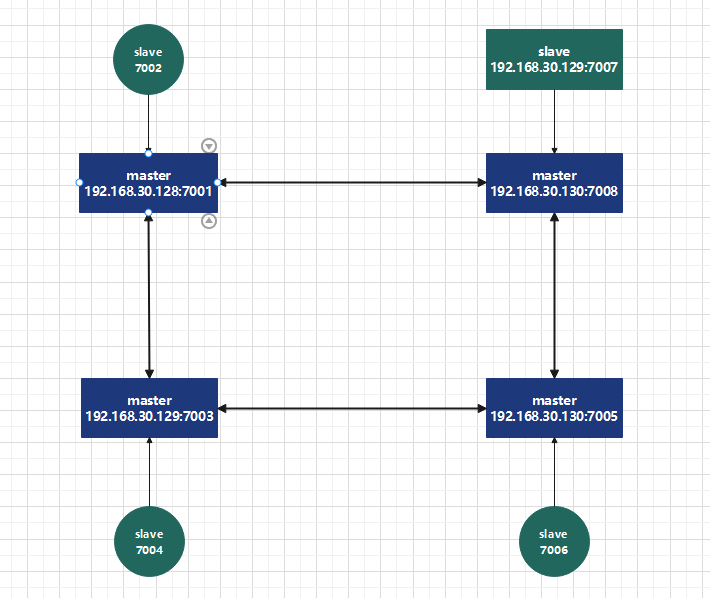


#### 4. 删除节点

==CLUSTER FORGET 1a1c7f02fce87530bd5abdfc98df1cffce4f1767【节点id】==

- **无法删除登录节点**
- **不能删除自己的master节点**
- **可以删除其它的master节点**
- **可以删除其它的slave节点**

```yaml
#无法删除登录节点
192.168.30.130:7008> CLUSTER FORGET 1a1c7f02fce87530bd5abdfc98df1cffce4f1767
(error) ERR I tried hard but I can't forget myself...               

#不能删除自己的master节点
192.168.30.130:7008> CLUSTER FORGET e51ab166bc0f33026887bcf8eba0dff3d5b0bf14
(error) ERR Can't forget my master!                

#可以删除其它的master节点
192.168.30.130:7008> CLUSTER FORGET 6788453ee9a8d7f72b1d45a9093838efd0e501f1
OK              

192.168.30.130:7008> CLUSTER NODES

277daeb8660d5273b7c3e05c263f861ed5f17b92 192.168.30.130:7006@17006 slave 4d74ec66e898bf09006dac86d4928f9fad81f373 0 1557458887328 3 connected
80c80a3f3e33872c047a8328ad579b9bea001ad8 192.168.30.128:7001@17001 master - 0 1557458887000 1 connected 0-5460
4d74ec66e898bf09006dac86d4928f9fad81f373 192.168.30.129:7003@17003 master - 0 1557458886000 3 connected 5461-10922
b4d3eb411a7355d4767c6c23b4df69fa183ef8bc 192.168.30.128:7002@17002 slave - 0 1557458888351 5 connected
1a1c7f02fce87530bd5abdfc98df1cffce4f1767 192.168.30.130:7008@17008 myself,slave e51ab166bc0f33026887bcf8eba0dff3d5b0bf14 0 1557458885000 7 connected
b6331cbc986794237c83ed2d5c30777c1551546e 192.168.30.129:7004@17004 slave 80c80a3f3e33872c047a8328ad579b9bea001ad8 0 1557458883289 1 connected
e51ab166bc0f33026887bcf8eba0dff3d5b0bf14 192.168.30.129:7007@17007 master - 0 1557458885310 0 connected

#可以删除其它的slave节点
192.168.30.130:7008> CLUSTER FORGET b4d3eb411a7355d4767c6c23b4df69fa183ef8bc
OK              

192.168.30.130:7008> CLUSTER NODES

277daeb8660d5273b7c3e05c263f861ed5f17b92 192.168.30.130:7006@17006 slave 4d74ec66e898bf09006dac86d4928f9fad81f373 0 1557459031397 3 connected
80c80a3f3e33872c047a8328ad579b9bea001ad8 192.168.30.128:7001@17001 master - 0 1557459032407 1 connected 0-5460
4d74ec66e898bf09006dac86d4928f9fad81f373 192.168.30.129:7003@17003 master - 0 1557459035434 3 connected 5461-10922
6788453ee9a8d7f72b1d45a9093838efd0e501f1 192.168.30.130:7005@17005 master - 0 1557459034000 5 connected 10923-16383
1a1c7f02fce87530bd5abdfc98df1cffce4f1767 192.168.30.130:7008@17008 myself,slave e51ab166bc0f33026887bcf8eba0dff3d5b0bf14 0 1557459032000 7 connected
b6331cbc986794237c83ed2d5c30777c1551546e 192.168.30.129:7004@17004 slave 80c80a3f3e33872c047a8328ad579b9bea001ad8 0 1557459034000 1 connected
e51ab166bc0f33026887bcf8eba0dff3d5b0bf14 192.168.30.129:7007@17007 master - 0 1557459034427 0 connected

```


# —————–

# Redis命令

**redis查看配置文件的命令**

> ```
> 127.0.0.1:6380> config get dir
> 1) "dir"
> 2) "/myredis"
> 127.0.0.1:6380> config get dbfilename
> 1) "dbfilename"
> 2) "dump6380.rdb"
> 127.0.0.1:6380> config get masterauth
> 1) "masterauth"
> 2) "123456"
> 127.0.0.1:6380> 
> ```


# Linux命令

**ps -ef | grep redis：查询 redis 相关的进程**

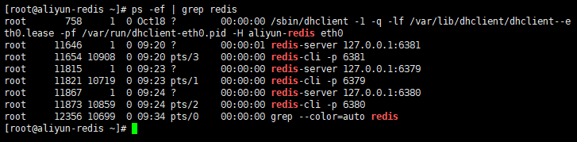

**rm -rf Documents：删除某个目录及其内的子文件或子目录，一并都强制删除：**

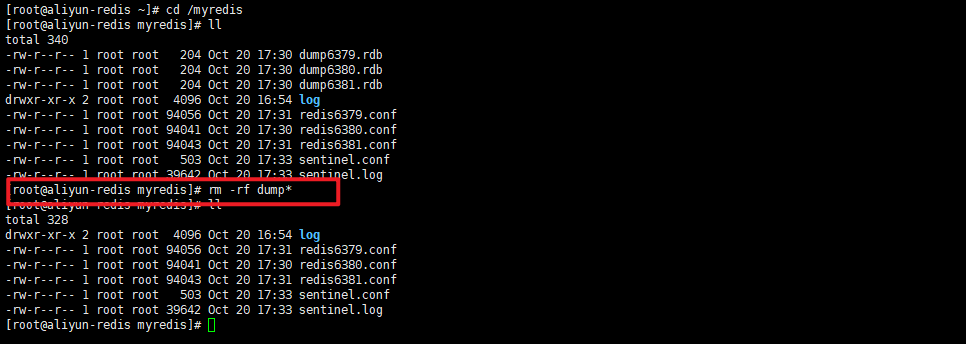

# Vim命令

**vim查询命令：**

**命令模式使用 `/Xxx`向下查询，`？Xxx`向上查询，键盘按 n 往下查看 N(shfit+n）向上查看**

**命令模式使用 %s/a/b：把a批量替换成b**


ACID：`原子性 (Atomicity)、 一致性(Consistency)、隔离性(Isolation) 和 持久性(Durability)`。	

Json格式：

https://db-engines.com/en/ranking


# 问题

## 1. vim编辑状态下手残按了ctrl + z，怎么办？

### 1. 问题过程描述

不小心手残，按了ctrl + z，显示：


使用`# vim redis.conf`显示：
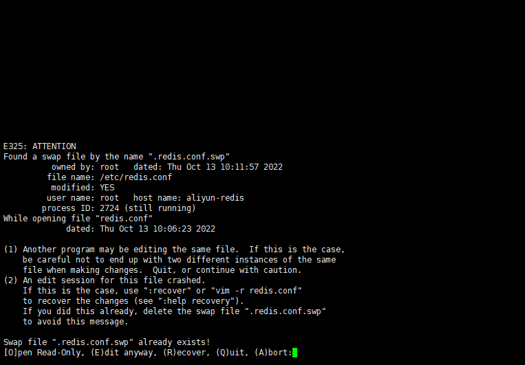

原来ctrl + z是强制将进程挂起，后台运行，会生成一个后缀为.swp的隐藏文件，接下来每次`# vim redis.conf`都会显示上面那个界面。


### 2. 解决

两种解决方案：

- ctrl+z 退出后，在显示[1]+ Stopped vi db.json时，终端直接输入fg 1（中括号中显示的数字，即作业号，若只有一个，作业号可忽略）这样就会重回vim编辑界面了，然后正常退出即可。

- `ls -a `一下，会看到隐藏的.swp文件 删除了此文件即可，再次使用vim打开文件就不会出现上述界面了。

  >**-a   列出目录下的所有文件（含隐藏文件）**


## 2. 将6个节点合成集群是连接出错

### 1. 问题描述

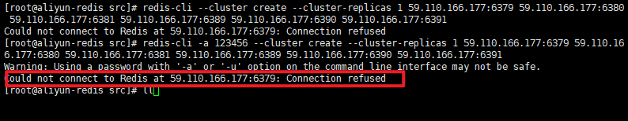

### 2. 问题解决

- **允许我们自己的真实ip访问**
  

- **使用阿里云需要在安全组中开放相应端口**
- **然后防火墙开启端口**
